# Image Classification Benchmarking Report

**Samuel Collins**  
Ph.D. Student, Department of Cyber-Physical Systems  
Clark Atlanta University  
samuel.collins@students.cau.edu

**Course:** CCIS 727 — Introduction to Computer Vision  
**Instructor:** Dr. Kishor Gupta  
**Date:** September 16, 2026

## 1. Objective

This report compares sixteen image classification methods on one problem: four classical machine-learning models, two neural network baselines, and ten deep CNN architectures spanning 2012 to 2024. All of them are driven through a single public function in an installable package, `Samuel_Collins_CV_Benchmarking`.

It is in two parts. **Part 1**, sections 1 to 8, benchmarks the classical models and the two neural baselines on flattened 64x64 pixels, and varies training set size, color mode and dataset one at a time. **Part 2**, sections 9 to 18, adds AlexNet, VGG16, GoogLeNet, ResNet18, ResNet50, DenseNet121, MobileNetV3, EfficientNet-B0, ConvNeXt-Tiny and a YOLO classifier at 224x224 and compares them directly against those baselines — on the identical images, the same seed, the same held-out test half, and the same scoring code.

Every model in a given run sees one stratified split, one set of metrics and one measurement of cost. Across the Part 1 runs, exactly one thing changes at a time: the size of the training set, the color mode, or the dataset. There are 6 runs over 2 datasets.

```python
from samuel_collins_cv_benchmarking import benchmark_image_classification

results = benchmark_image_classification(
    dataset="./data/animals10_n500/labels.csv",
    dataset_type="csv",
    target_labels="class_name",
    color_mode="rgb",
)
```

## 2. Datasets

### Animals-10

- **Source:** `alessiocorrado99/animals10` (Kaggle)
- **Classes (10):** butterfly, cat, chicken, cow, dog, elephant, horse, sheep, spider, squirrel
- **Native size:** mostly 4:3 photographs, median aspect ratio 1.37
- **Padding at 64x64:** 27.0% mean, 40.0% at the 90th percentile, 76.3% worst

Only 7.3% of the images are square, so preserving aspect ratio costs more than a quarter of the 64x64 canvas.

### Intel Image Classification

- **Source:** `puneet6060/intel-image-classification` (Kaggle)
- **Classes (6):** buildings, forest, glacier, mountain, sea, street
- **Native size:** 150x150, square (99.6% exactly)
- **Padding at 64x64:** 0.1% mean, 0.0% at the 90th percentile

Larger than the 64x64 internal size and square, so every image downscales into the canvas with no padding.

**Sampling.** Per class, the file list is sorted, shuffled with a seed derived from the class name, and the first N images that decode successfully are taken. Because the seed never depends on N, a smaller subset is a byte-identical prefix of a larger one, which is what makes two sizes comparable as a learning curve.

**Standardization.** Every image is fitted into 64x64 by scaling the longest side and padding the remainder with zeros, then normalized to [0, 1]. Aspect ratio is preserved rather than stretched.

## 3. Method

**One split, reused.** The split produces indices rather than data. The classical models consume flattened feature vectors and the CNN consumes image tensors; both are sliced with the same index array, so the two representations cannot disagree about which images are in which half.

**Scaling without leakage.** Logistic Regression, the SVM and the fully connected network are wrapped in a pipeline with a standard scaler, so it is fitted on training rows only. Fitting it before the split does not fail or warn — it simply lets the test set's statistics shape the training transformation, and every scaled model then scores slightly too high.

**Early stopping without leakage.** The neural models hold out 15% of the training half to decide when to stop, because choosing when to stop is a decision informed by data and cannot use the test set. The consequence is that the neural models train on about 68% of all images where the classical models get the full 80%.

**Ranking.** By macro F1, ties broken by lower inference time. Macro F1 rather than accuracy because it weights every class equally: a model that ignores a small class can still post high accuracy.

## 4.1 Animals-10 — rgb, 500 per class

```python
results = benchmark_image_classification(
    dataset="./data/animals10_n500/labels.csv",
    dataset_type="csv",
    target_labels="class_name",
    color_mode="rgb",
)
```

5,000 images, 10 classes, split 4,000 training / 1,000 testing at seed 42.


| Model | Accuracy | Macro Precision | Macro Recall | Macro F1 | Weighted F1 | Training Time (s) | Inference Time (ms/img) |
|---|---|---|---|---|---|---|---|
| Simple CNN | 0.433 | 0.446 | 0.433 | 0.434 | 0.434 | 41.5 | 0.399 |
| SVM | 0.353 | 0.362 | 0.353 | 0.352 | 0.352 | 418.6 | 89.960 |
| Random Forest | 0.322 | 0.331 | 0.322 | 0.319 | 0.319 | 2.8 | 0.028 |
| Neural Network | 0.287 | 0.280 | 0.287 | 0.281 | 0.281 | 1.3 | 0.025 |
| Logistic Regression | 0.226 | 0.230 | 0.226 | 0.225 | 0.225 | 10.8 | 0.029 |
| Decision Tree | 0.180 | 0.182 | 0.180 | 0.180 | 0.180 | 20.9 | 0.002 |

**Best: Simple CNN**, macro F1 0.434 (4.3x the 0.100 chance level for 10 classes).


**Most frequent confusions.**

| True class | Predicted as | Images |
|---|---|---|
| cat | dog | 27 |
| cow | sheep | 25 |
| horse | sheep | 21 |
| elephant | sheep | 19 |
| dog | cat | 16 |

## 4.2 Animals-10 — rgb, 100 per class

```python
results = benchmark_image_classification(
    dataset="./data/animals10_n100/labels.csv",
    dataset_type="csv",
    target_labels="class_name",
    color_mode="rgb",
)
```

1,000 images, 10 classes, split 800 training / 200 testing at seed 42.


| Model | Accuracy | Macro Precision | Macro Recall | Macro F1 | Weighted F1 | Training Time (s) | Inference Time (ms/img) |
|---|---|---|---|---|---|---|---|
| Simple CNN | 0.320 | 0.323 | 0.320 | 0.295 | 0.295 | 6.4 | 0.446 |
| Random Forest | 0.300 | 0.310 | 0.300 | 0.294 | 0.294 | 0.5 | 0.137 |
| SVM | 0.240 | 0.265 | 0.240 | 0.242 | 0.242 | 26.5 | 19.836 |
| Logistic Regression | 0.215 | 0.216 | 0.215 | 0.213 | 0.213 | 1.4 | 0.030 |
| Neural Network | 0.180 | 0.182 | 0.180 | 0.178 | 0.178 | 0.3 | 0.026 |
| Decision Tree | 0.095 | 0.091 | 0.095 | 0.093 | 0.093 | 3.2 | 0.002 |

**Best: Simple CNN**, macro F1 0.295 (2.9x the 0.100 chance level for 10 classes).


**Most frequent confusions.**

| True class | Predicted as | Images |
|---|---|---|
| squirrel | cat | 8 |
| cow | sheep | 7 |
| horse | sheep | 6 |
| spider | cat | 6 |
| cow | horse | 4 |

## 4.3 Animals-10 — grayscale, 500 per class

```python
results = benchmark_image_classification(
    dataset="./data/animals10_n500/labels.csv",
    dataset_type="csv",
    target_labels="class_name",
    color_mode="grayscale",
)
```

5,000 images, 10 classes, split 4,000 training / 1,000 testing at seed 42.


| Model | Accuracy | Macro Precision | Macro Recall | Macro F1 | Weighted F1 | Training Time (s) | Inference Time (ms/img) |
|---|---|---|---|---|---|---|---|
| Simple CNN | 0.351 | 0.351 | 0.351 | 0.349 | 0.349 | 41.9 | 0.257 |
| Random Forest | 0.299 | 0.308 | 0.299 | 0.296 | 0.296 | 1.7 | 0.027 |
| SVM | 0.283 | 0.294 | 0.283 | 0.281 | 0.281 | 12.8 | 3.940 |
| Neural Network | 0.253 | 0.255 | 0.253 | 0.251 | 0.251 | 0.5 | 0.009 |
| Decision Tree | 0.191 | 0.190 | 0.191 | 0.190 | 0.190 | 6.7 | 0.001 |
| Logistic Regression | 0.169 | 0.169 | 0.169 | 0.167 | 0.167 | 5.6 | 0.013 |

**Best: Simple CNN**, macro F1 0.349 (3.5x the 0.100 chance level for 10 classes).


**Most frequent confusions.**

| True class | Predicted as | Images |
|---|---|---|
| cow | horse | 20 |
| dog | cat | 19 |
| cow | sheep | 17 |
| cat | dog | 16 |
| cat | spider | 15 |

## 4.4 Animals-10 — grayscale, 100 per class

```python
results = benchmark_image_classification(
    dataset="./data/animals10_n100/labels.csv",
    dataset_type="csv",
    target_labels="class_name",
    color_mode="grayscale",
)
```

1,000 images, 10 classes, split 800 training / 200 testing at seed 42.

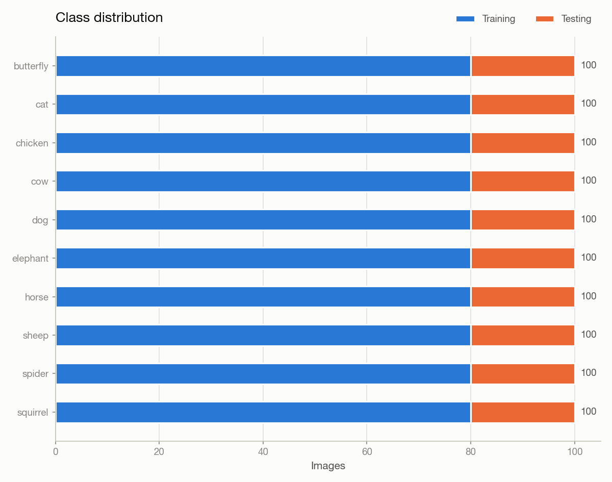

| Model | Accuracy | Macro Precision | Macro Recall | Macro F1 | Weighted F1 | Training Time (s) | Inference Time (ms/img) |
|---|---|---|---|---|---|---|---|
| Simple CNN | 0.260 | 0.269 | 0.260 | 0.249 | 0.249 | 7.1 | 0.224 |
| Random Forest | 0.255 | 0.242 | 0.255 | 0.239 | 0.239 | 0.3 | 0.124 |
| SVM | 0.215 | 0.214 | 0.215 | 0.207 | 0.207 | 0.6 | 0.801 |
| Neural Network | 0.200 | 0.191 | 0.200 | 0.191 | 0.191 | 0.1 | 0.011 |
| Logistic Regression | 0.135 | 0.134 | 0.135 | 0.132 | 0.132 | 1.7 | 0.012 |
| Decision Tree | 0.125 | 0.136 | 0.125 | 0.129 | 0.129 | 1.2 | 0.001 |

**Best: Simple CNN**, macro F1 0.249 (2.5x the 0.100 chance level for 10 classes).

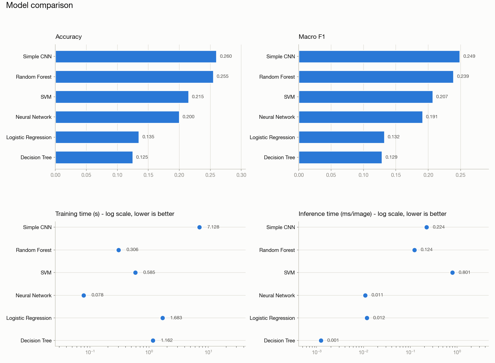

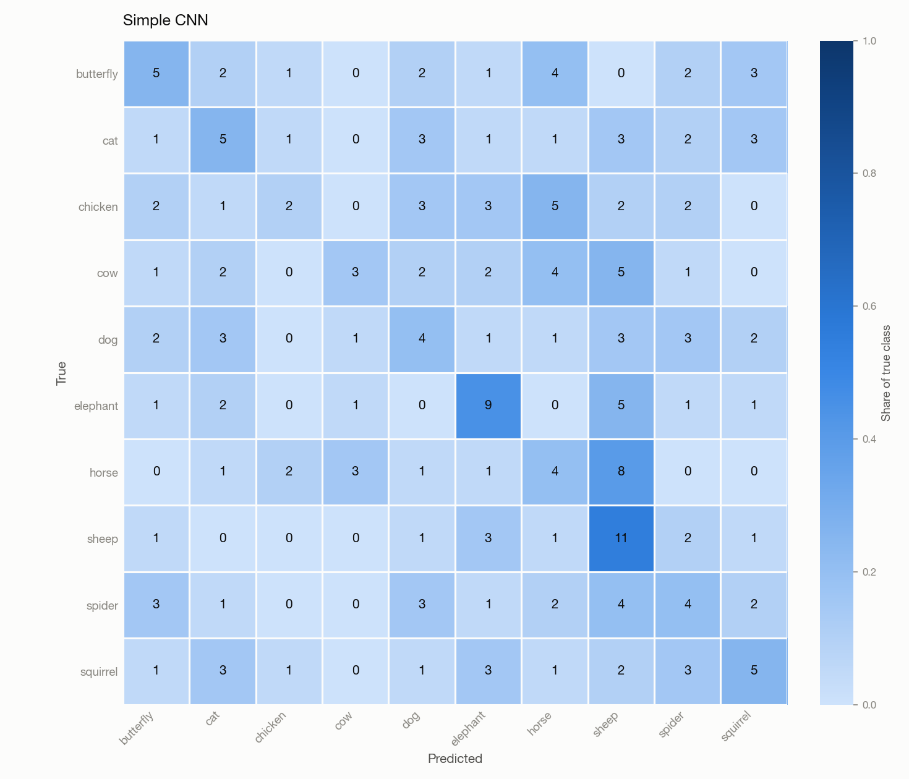

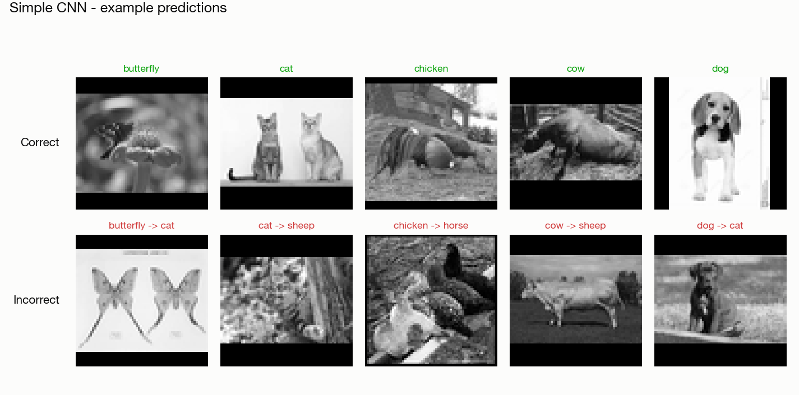

**Most frequent confusions.**

| True class | Predicted as | Images |
|---|---|---|
| horse | sheep | 8 |
| chicken | horse | 5 |
| cow | sheep | 5 |
| elephant | sheep | 5 |
| butterfly | horse | 4 |

## 4.5 Intel Image Classification — rgb, 500 per class

```python
results = benchmark_image_classification(
    dataset="./data/intel_n500/labels.csv",
    dataset_type="csv",
    target_labels="class_name",
    color_mode="rgb",
)
```

3,000 images, 6 classes, split 2,400 training / 600 testing at seed 42.


| Model | Accuracy | Macro Precision | Macro Recall | Macro F1 | Weighted F1 | Training Time (s) | Inference Time (ms/img) |
|---|---|---|---|---|---|---|---|
| Simple CNN | 0.705 | 0.712 | 0.705 | 0.704 | 0.704 | 26.6 | 0.399 |
| SVM | 0.625 | 0.622 | 0.625 | 0.621 | 0.621 | 109.9 | 83.581 |
| Random Forest | 0.570 | 0.566 | 0.570 | 0.564 | 0.564 | 2.4 | 0.047 |
| Neural Network | 0.498 | 0.515 | 0.498 | 0.499 | 0.499 | 0.7 | 0.024 |
| Decision Tree | 0.395 | 0.398 | 0.395 | 0.396 | 0.396 | 14.4 | 0.002 |
| Logistic Regression | 0.393 | 0.406 | 0.393 | 0.395 | 0.395 | 4.1 | 0.040 |

**Best: Simple CNN**, macro F1 0.704 (4.2x the 0.167 chance level for 6 classes).


**Most frequent confusions.**

| True class | Predicted as | Images |
|---|---|---|
| street | buildings | 20 |
| sea | glacier | 19 |
| glacier | mountain | 17 |
| sea | mountain | 12 |
| buildings | street | 10 |

## 4.6 Intel Image Classification — grayscale, 500 per class

```python
results = benchmark_image_classification(
    dataset="./data/intel_n500/labels.csv",
    dataset_type="csv",
    target_labels="class_name",
    color_mode="grayscale",
)
```

3,000 images, 6 classes, split 2,400 training / 600 testing at seed 42.


| Model | Accuracy | Macro Precision | Macro Recall | Macro F1 | Weighted F1 | Training Time (s) | Inference Time (ms/img) |
|---|---|---|---|---|---|---|---|
| Simple CNN | 0.657 | 0.657 | 0.657 | 0.656 | 0.656 | 30.3 | 0.238 |
| SVM | 0.528 | 0.523 | 0.528 | 0.516 | 0.516 | 3.5 | 2.485 |
| Random Forest | 0.505 | 0.500 | 0.505 | 0.497 | 0.497 | 1.5 | 0.027 |
| Neural Network | 0.442 | 0.434 | 0.442 | 0.433 | 0.433 | 0.3 | 0.010 |
| Decision Tree | 0.307 | 0.310 | 0.307 | 0.307 | 0.307 | 5.0 | 0.001 |
| Logistic Regression | 0.293 | 0.305 | 0.293 | 0.292 | 0.292 | 2.5 | 0.017 |

**Best: Simple CNN**, macro F1 0.656 (3.9x the 0.167 chance level for 6 classes).


**Most frequent confusions.**

| True class | Predicted as | Images |
|---|---|---|
| buildings | street | 19 |
| sea | mountain | 19 |
| glacier | mountain | 16 |
| mountain | sea | 15 |
| glacier | sea | 14 |

## 5. Experiment: training set size

Same dataset, same color mode, nested subsets — the smaller set is a strict prefix of the larger, so this is a learning curve rather than two unrelated samples.

**Animals-10, grayscale**

| Model | 100/class | 500/class | change |
|---|---|---|---|
| Simple CNN | 0.249 | 0.349 | +40% |
| Random Forest | 0.239 | 0.296 | +24% |
| SVM | 0.207 | 0.281 | +36% |
| Neural Network | 0.191 | 0.251 | +31% |
| Decision Tree | 0.129 | 0.190 | +48% |
| Logistic Regression | 0.132 | 0.167 | +26% |

Simple CNN leads at both sizes, but its margin over the runner-up widens from 0.010 to 0.053 macro F1. Models whose scores have flattened are near what raw pixels can give them; models still climbing would gain more from data than from a change of architecture.

**Animals-10, rgb**

| Model | 100/class | 500/class | change |
|---|---|---|---|
| Simple CNN | 0.295 | 0.434 | +47% |
| SVM | 0.242 | 0.352 | +45% |
| Random Forest | 0.294 | 0.319 | +9% |
| Neural Network | 0.178 | 0.281 | +58% |
| Logistic Regression | 0.213 | 0.225 | +6% |
| Decision Tree | 0.093 | 0.180 | +94% |

Simple CNN leads at both sizes, but its margin over the runner-up widens from 0.001 to 0.082 macro F1. Models whose scores have flattened are near what raw pixels can give them; models still climbing would gain more from data than from a change of architecture.

## 6. Experiment: color

Identical images in both columns; only `color_mode` differs. Grayscale gives 4,096 features per image against RGB's 12,288.

| Model | Animals-10 | Animals-10 | Intel Image Classification |
|---|---|---|---|
| Simple CNN | +18% | +24% | +7% |
| Random Forest | +23% | +8% | +14% |
| SVM | +17% | +25% | +20% |
| Neural Network | -7% | +12% | +15% |
| Logistic Regression | +61% | +34% | +35% |
| Decision Tree | -28% | -5% | +29% |

**Neural Network disagrees across datasets** (Animals-10 -7%, Animals-10 +12%, Intel Image Classification +15%), so the effect belongs to the data rather than to the model. Where a class is separable by color directly, one threshold on one channel is informative; where it is not, the extra channels are mostly noise to a model with no ensemble to average them away.

**Decision Tree disagrees across datasets** (Animals-10 -28%, Animals-10 -5%, Intel Image Classification +29%), so the effect belongs to the data rather than to the model. Where a class is separable by color directly, one threshold on one channel is informative; where it is not, the extra channels are mostly noise to a model with no ensemble to average them away.

**Cost.** RGB triples the feature count, and the SVM pays more than three times for it:

| Dataset | SVM training, grayscale | SVM training, RGB | factor |
|---|---|---|---|
| Animals-10 | 0.6 s | 26.5 s | 45x |
| Animals-10 | 12.8 s | 418.6 s | 33x |
| Intel Image Classification | 3.5 s | 109.9 s | 31x |

## 7. Experiment: dataset and padding

The two datasets differ in how much of the 64x64 canvas survives standardization: Animals-10 loses 27% to padding, Intel essentially none. They also differ in class count, which has to be accounted for before the padding question can be asked at all.

| Model | Animals-10 (10c) | Intel Image Classification (6c) | Animals-10 x chance | Intel Image Classification x chance |
|---|---|---|---|---|
| Simple CNN | 0.434 | 0.704 | 4.34 | 4.22 |
| SVM | 0.352 | 0.621 | 3.52 | 3.73 |
| Random Forest | 0.319 | 0.564 | 3.19 | 3.38 |
| Neural Network | 0.281 | 0.499 | 2.81 | 2.99 |
| Logistic Regression | 0.225 | 0.395 | 2.25 | 2.37 |
| Decision Tree | 0.180 | 0.396 | 1.80 | 2.38 |

Raw scores are much higher on the dataset with fewer classes, which is what a lower chance level buys before any model does anything. Expressed as a multiple of chance the two are close (Intel Image Classification 3.18x, Animals-10 2.99x), and on that basis the padded dataset is not obviously the harder one.

**This is evidence about padding, not a measurement of it.** Class count, task difficulty and dataset size all differ between these runs, so the honest conclusion is that padding is not the dominant limitation here, not that it is free. Isolating it would need the same dataset run with and without padding, or a subset of Animals-10 cut to the same class count.

## 8. Computational cost

From animals10_n500_rgb:

| Model | Training (s) | Inference (ms/image) | Macro F1 |
|---|---|---|---|
| Simple CNN | 41.5 | 0.399 | 0.434 |
| SVM | 418.6 | 89.960 | 0.352 |
| Random Forest | 2.8 | 0.028 | 0.319 |
| Neural Network | 1.3 | 0.025 | 0.281 |
| Logistic Regression | 10.8 | 0.029 | 0.225 |
| Decision Tree | 20.9 | 0.002 | 0.180 |

Inference cost spans a factor of 49,200 between Decision Tree and SVM. Classifying a thousand images would take SVM about 90.0 seconds against Decision Tree's 0.002 seconds.

Accuracy alone would not surface this. A model chosen on macro F1 for a CPU-bound application could be unusable in practice, which is why the ranking breaks ties on the lower inference time.


---

# Part 2: Traditional Machine Learning against Modern CNN Architectures

## 9. The question this part answers

Part 1 benchmarked four traditional classifiers, a fully connected network and a small convolutional network on flattened 64x64 pixels. Part 2 adds ten deep architectures spanning a decade of design, from AlexNet to ConvNeXt and a YOLO classifier, and asks how much they actually improve on those baselines when nothing else changes.

Nothing else does change. The dataset, the class labels, the random seed, the train/test division and the scoring code are the ones Part 1 used. The only thing that differs is what each model is shown: the traditional models keep their flattened 64x64 vectors, and the deep architectures receive 224x224 image tensors of the identical photographs. That is the whole point of the design — a model tested on different data cannot be compared with the Part 1 results, so the split is reproduced from the same manifest at the same seed and verified against Part 1's own published artifacts before any training starts.

### The headline result

The best deep architecture, **VGG16**, reaches **94.4%** accuracy on the shared test half. The best traditional classifier, **SVM**, reaches **35.3%**, and the strongest Part 1 model overall, **Simple CNN**, reaches **43.3%**. That is an absolute improvement of **59.1%**, or about **2.7 times** the traditional model's accuracy, against a 10.0% chance level on 10 balanced classes.

The size of that gap is the finding, and it is worth being precise about where it comes from. Both halves of the benchmark see the same photographs. The traditional models are not handicapped by a smaller sample or an easier test set; they are handicapped by having to classify a photograph from raw pixel values with no notion of locality, and by a 64x64 representation that the assignment fixed in Part 1. The deep architectures bring two advantages at once — a convolutional inductive bias, and features already learned from ImageNet — and the experiment as specified does not separate those two contributions.

## 10. Experimental protocol

Every deep architecture was trained under identical settings, so that training time and accuracy remain comparable across them.

| Setting | Value |
|---|---|
| Dataset | `animals10_n500_rgb` - the Part 1 configuration, unchanged |
| Classes | 10 |
| Input size | 224 x 224 |
| Epochs | 20 |
| Batch size | 64 |
| Optimizer | AdamW |
| Initial learning rate | 0.001 |
| Weight decay | 0.01 |
| Loss | CrossEntropyLoss |
| Pretrained weights | yes, ImageNet |
| Backbone frozen | no - all layers fine-tuned |
| Early stopping | none - every architecture runs the full epoch budget |
| Checkpoint selection | highest validation accuracy |
| Random seed | 42 |

### The three-way split

Section 12 requires the checkpoint with the best validation accuracy, and section 3 requires the test half to stay unseen until model selection is finished. Part 1's split is train and test only, so a validation set had to come from somewhere — and it could not come from the test half without breaking both requirements at once.

It is carved out of the training half instead, at the same fraction and seed the Part 1 Simple CNN already used for its own early stopping. Two consequences follow, and both are stated rather than left to be discovered:

- The test half is **identical** to Part 1's: 1000 images, unchanged and unseen until selection was complete.
- Neural models train on 3400 images (68% of the dataset) and validate on 600 (12%), while the traditional models trained on the full 80% training half. The deep architectures therefore see **less** training data than the classifiers they are compared against, not more.
- Every neural model, the Part 1 Simple CNN included, validates on the identical rows, so their convergence curves are comparable to each other rather than each to itself.

### Preprocessing

Training transformations resize to 224x224, take a random crop and apply a random horizontal flip before normalizing with the ImageNet statistics the pretrained weights expect. Validation and test transformations resize and normalize only — section 7 forbids random augmentation there, and a model selected against augmented validation images would be selected on noise.

One implementation detail follows from that. `Resize((224, 224))` followed by `RandomCrop` does nothing unless the source image is larger than the crop, so the training half is decoded and cached at 256x256 to give the crop real headroom, while validation and test images are cached at exactly 224x224 so their pipeline is the resize-only one the assignment specifies. Each image is decoded once and augmented from memory thereafter; decoding 3,400 JPEGs afresh for every epoch of every architecture would have cost more than the training itself.

### Which pretrained weights were actually loaded

`weights="DEFAULT"` does not name a fixed checkpoint. torchvision repoints it as better weights are published, so the same line of code loads different numbers at different times, and a report that only says "pretrained" has not said enough to be reproduced.

| Architecture | Pretrained weights |
|---|---|
| AlexNet | AlexNet_Weights.IMAGENET1K_V1 |
| VGG16 | VGG16_Weights.IMAGENET1K_V1 |
| GoogLeNet | GoogLeNet_Weights.IMAGENET1K_V1 |
| ResNet18 | ResNet18_Weights.IMAGENET1K_V1 |
| ResNet50 | ResNet50_Weights.IMAGENET1K_V2 |
| DenseNet121 | DenseNet121_Weights.IMAGENET1K_V1 |
| MobileNetV3-Large | MobileNet_V3_Large_Weights.IMAGENET1K_V2 |
| EfficientNet-B0 | EfficientNet_B0_Weights.IMAGENET1K_V1 |
| ConvNeXt-Tiny | ConvNeXt_Tiny_Weights.IMAGENET1K_V1 |
| YOLO Classification | yolo11n-cls.pt |

This table contains a confound worth stating plainly. **ResNet50**, **MobileNetV3-Large** resolve to `IMAGENET1K_V2` weights while the others resolve to `V1`. The V2 checkpoints are the same architectures trained with a later and better recipe — longer schedules, stronger augmentation, improved regularization — not different networks. So those architectures begin fine-tuning from a stronger starting point than the rest, and some part of their advantage in the results below is attributable to that rather than to their design.

Equalizing it was possible — every architecture could have been pinned to V1 — but section 8 specifies `weights="DEFAULT"` explicitly, and silently substituting a different checkpoint would have been a larger and less visible deviation than reporting this one. The effect is small relative to the gap between the traditional and deep halves, which is what this benchmark is primarily measuring, but it should temper any close reading of the ranking among the deep architectures themselves.

### Documented deviations

Section 6 permits adjustments where an architecture becomes unstable and section 22 asks that an unmeasurable quantity be reported as N/A rather than invented. Both require the change to be documented, so every departure from the letter of the protocol is listed here. None of them is silent, and none of them is a number that was made up.

| Item | Deviation | How it is handled |
|---|---|---|
| GPU memory measurement (section 21) | No CUDA device on this host, so torch.cuda.max_memory_allocated cannot be called. | Reported as the MPS driver allocation sampled once per epoch, labeled as such. Not presented as a CUDA peak. |
| GoogLeNet auxiliary classifiers | Disabled so that every architecture's forward pass returns a single logit tensor and one shared training loop can serve all nine. | Removes GoogLeNet's auxiliary loss and 4,329,984 parameters. Inference-time architecture is unchanged, since the auxiliary branches are discarded at inference anyway. |
| Training device | The Part 1 Simple CNN trains on CPU for cross-machine determinism; the deep architectures train on MPS. | Unavoidable - nine networks at 224x224 are not tractable on CPU. Recorded in every result. |
| Validation split | The Part 1 split is train/test only, and section 12 requires selection on validation accuracy. | Validation is carved from the training half at the same fraction and seed the Part 1 Simple CNN already used, so the test half is unchanged and both model families validate on identical rows. |
| Computational complexity (section 22) | fvcore and thop both count multiply-accumulates and label the total 'flops'. | Reported as MACs, with FLOPs derived explicitly as 2x MACs. Operators the profiler could not account for are listed per architecture. |
| YOLO classification | ultralytics excludes numpy 2.0-2.3.4 on macOS and numpy >= 2.3.5 needs Python 3.11+, so installing it would downgrade numpy beneath the environment that produced the Part 1 results. | Run as a subprocess in a separate virtual environment against the identical split, writing the same artifacts. Its environment is recorded separately. |

#### The learning rate, and the two architectures that needed a different one

This is the most consequential deviation, and it is also a result rather than merely an adjustment.

At the prescribed AdamW learning rate of 0.001, 2 of the ten architectures failed to train properly, in two distinguishable ways. **AlexNet** collapsed outright: training loss sat at approximately ln(10), the value a network emits when its output is uniform across ten classes, and accuracy stayed at chance for all twenty epochs. The pretrained features were destroyed within the first few steps and never recovered. **VGG16** did not collapse but was crippled, climbing off chance only to finish at 38.9% test accuracy — roughly a third of what comparable architectures reached on the identical split. That is the more insidious failure of the two, because a number like that looks like a weak result rather than a broken run.

Which architectures failed is the interesting part. Both predate batch normalization. Every architecture in the benchmark carrying BatchNorm or LayerNorm trained at the prescribed rate without difficulty and was left untouched. Normalization layers absorb a step of this size; without them, a 0.001 AdamW step on ImageNet-pretrained weights is large enough to be unrecoverable. The requirement to document a learning-rate change turns out to surface a genuine architectural property rather than a nuisance.

The failure was detected by a stated numeric rule rather than by eye — An architecture is treated as unstable at the protocol rate if its best validation accuracy fell below either 1.5x the 0.1000 chance level (total collapse) or 50% of the best validation accuracy reached by any architecture on the identical split under the identical protocol (crippled but not dead). — and the affected architectures were re-run at 0.0001. Both outcomes are kept:

| Architecture | Protocol LR | Test accuracy at protocol LR | Revised LR | Test accuracy at revised LR |
|---|---|---|---|---|
| AlexNet | 0.001 | 0.1000 | 0.0001 | 0.9000 |
| VGG16 | 0.001 | 0.3890 | 0.0001 | 0.9440 |

The results reported everywhere else in this document are the revised runs for these architectures and the protocol-rate runs for all the others. The protocol-rate attempt is preserved in `deep_metrics_protocol_lr.json` so the failure can be inspected rather than taken on trust.

### Hardware and software environment

Section 20 is explicit that inference benchmarks are not meaningful without the hardware they ran on.

| Component | Value |
|---|---|
| GPU | Apple Silicon integrated GPU via Metal (Apple M4 Max) |
| CPU | Apple M4 Max |
| RAM | 48.0 GB |
| Operating system | Darwin 25.6.0 (arm64) |
| Python | 3.9.6 |
| PyTorch | 2.8.0 |
| torchvision | 0.23.0 |
| NumPy | 2.0.2 |
| CUDA | not applicable - no CUDA device on this host |

There is no CUDA device on this host, which has one consequence worth stating plainly rather than burying. Section 21 asks for peak GPU memory via `torch.cuda.max_memory_allocated`, and that call cannot be made here. PyTorch's Metal backend exposes no peak-tracking API at all, only instantaneous allocation, so the memory figures in this report are live tensor allocation sampled repeatedly through the inference pass and carried as a maximum. That is a sampled maximum rather than a true peak, it is labeled as such in the results files, and it is not presented as a CUDA measurement.

Getting even that much right took two attempts, and the first one is worth recording because its output looked entirely plausible. The measurement originally read `driver_allocated_memory`, which is the process-wide allocator pool rather than any single model's footprint. The pool grows as models are loaded and is never handed back, so reading it once per architecture across a nine-architecture run produced a column that increased monotonically in run order — AlexNet at 2.4 GB, then every later architecture between 12 and 15 GB regardless of its size, with DenseNet121 apparently needing 12.7 GB. Those numbers described the order the architectures happened to run in, not the architectures. Since memory carries weight in the deployment ranking, the ranking would have inherited that ordering. The figures reported here were re-measured for every architecture in one consistent pass, from the saved checkpoints, with the allocator cache emptied between models.

## 11. Master benchmark table

Every model in the assignment, traditional and deep, scored on the same test half by the same code. Generated as `combined_ml_cnn_benchmark_results.csv`.

| Model | Family | Accuracy | Macro Precision | Macro Recall | Macro F1 | Weighted F1 | Total Parameters | Size MB | Train Time (s) | Latency (ms/img) | Throughput (img/s) | Memory MB |
|---|---|---|---|---|---|---|---|---|---|---|---|---|
| Logistic Regression | Traditional ML | 0.226 | 0.2304 | 0.226 | 0.2252 | 0.2252 | N/A | N/A | 10.8 | 0.029 | 34127.1 | N/A |
| Decision Tree | Traditional ML | 0.18 | 0.1819 | 0.18 | 0.1802 | 0.1802 | N/A | N/A | 20.9 | 0.002 | 546908.9 | N/A |
| Random Forest | Traditional ML | 0.322 | 0.3315 | 0.322 | 0.3188 | 0.3188 | N/A | N/A | 2.8 | 0.028 | 36092.3 | N/A |
| SVM | Traditional ML | 0.353 | 0.362 | 0.353 | 0.352 | 0.352 | N/A | N/A | 418.6 | 89.96 | 11.1 | N/A |
| Neural Network | Neural Baseline | 0.287 | 0.2803 | 0.287 | 0.2812 | 0.2812 | N/A | N/A | 1.3 | 0.025 | 40492.8 | N/A |
| Simple CNN | CNN Baseline | 0.433 | 0.4462 | 0.433 | 0.4336 | 0.4336 | N/A | N/A | 41.5 | 0.399 | 2508.9 | N/A |
| AlexNet | Deep CNN | 0.9 | 0.9032 | 0.9 | 0.9003 | 0.9003 | 57044810 | 228.18 | 70.3 | 0.274 | 3650.9 | 328.2 |
| VGG16 | Deep CNN | 0.944 | 0.9448 | 0.944 | 0.9441 | 0.9441 | 134301514 | 537.22 | 697.5 | 2.152 | 464.6 | 2219.9 |
| GoogLeNet | Multi-branch CNN | 0.895 | 0.9009 | 0.895 | 0.8955 | 0.8955 | 5610154 | 22.61 | 164.5 | 0.627 | 1594.8 | 472.1 |
| ResNet18 | Residual CNN | 0.865 | 0.8715 | 0.865 | 0.8643 | 0.8643 | 11181642 | 44.8 | 148.0 | 0.457 | 2187.0 | 494.3 |
| ResNet50 | Residual CNN | 0.918 | 0.92 | 0.918 | 0.918 | 0.918 | 23528522 | 94.42 | 383.7 | 1.283 | 779.6 | 800.8 |
| DenseNet121 | Dense CNN | 0.896 | 0.8989 | 0.896 | 0.8958 | 0.8958 | 6964106 | 28.43 | 381.1 | 1.526 | 655.5 | 1152.2 |
| MobileNetV3-Large | Efficient CNN | 0.904 | 0.9082 | 0.904 | 0.9034 | 0.9034 | 4214842 | 17.05 | 137.6 | 0.561 | 1783.8 | 517.9 |
| EfficientNet-B0 | Scaled CNN | 0.928 | 0.9293 | 0.928 | 0.9283 | 0.9283 | 4020358 | 16.36 | 250.1 | 0.726 | 1378.3 | 857.6 |
| ConvNeXt-Tiny | Modern CNN | 0.926 | 0.9296 | 0.926 | 0.9259 | 0.9259 | 27827818 | 111.37 | 602.8 | 1.748 | 572.1 | 920.6 |
| YOLO Classification | Modern Classifier | 0.939 | 0.9392 | 0.939 | 0.939 | 0.939 | 1543914 | 3.21 | 207.6 | 1.265 | 790.3 | N/A |

`N/A` is used where a metric is not meaningful for a model rather than where it was inconvenient to obtain. A Random Forest has no parameter count in the sense a CNN does, no checkpoint on disk and no device memory figure; writing 0 in those cells would put three fabricated measurements into the headline table. Weighted precision and weighted recall for the Part 1 models, which Part 1 did not record, were recomputed from the confusion matrices it did store — a confusion matrix determines every averaged classification metric exactly — and the derivation is checked against Part 1's own stored macro figures before any of it is used.

## 12. Comparison visualizations

Each figure carries the traditional baselines and the deep architectures together wherever the metric applies to both, colored by group so the progression is visible. Color encodes three groups rather than the eleven families in the table above: eleven categorical hues cannot be told apart, and the two scatter plots are a chart form where even a validated palette caps at three. The finer family stays on the axis label and in the table, where there is room to read it.

### Test accuracy

The single clearest picture of the gap between the two halves.


### Macro F1

Macro F1 weights every class equally, so a model that quietly abandons a class cannot hide behind overall accuracy.

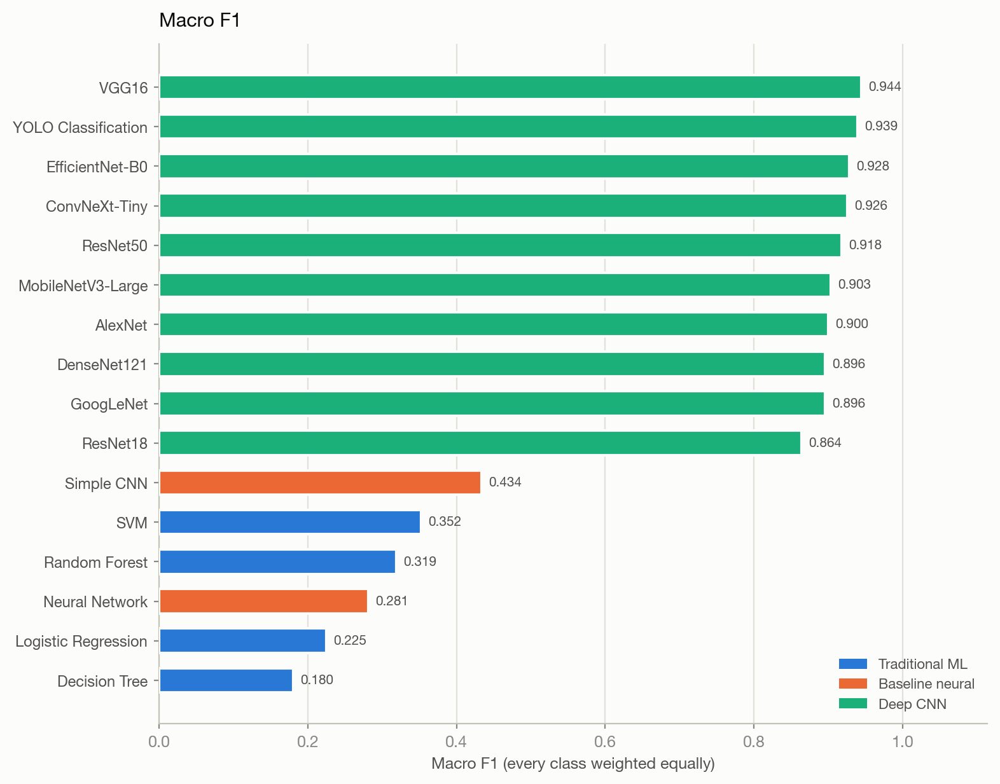

### Parameter count

Log scale: the deep architectures span from about four million parameters to over a hundred and thirty million.

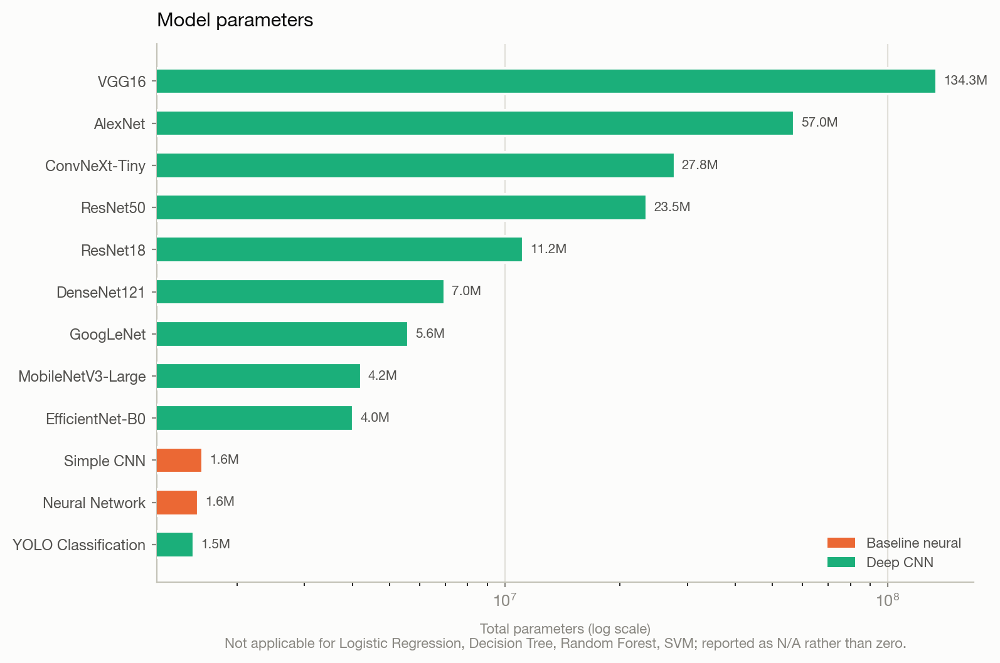

### Checkpoint size

What each trained model costs to store, which is a hard constraint on an embedded target.

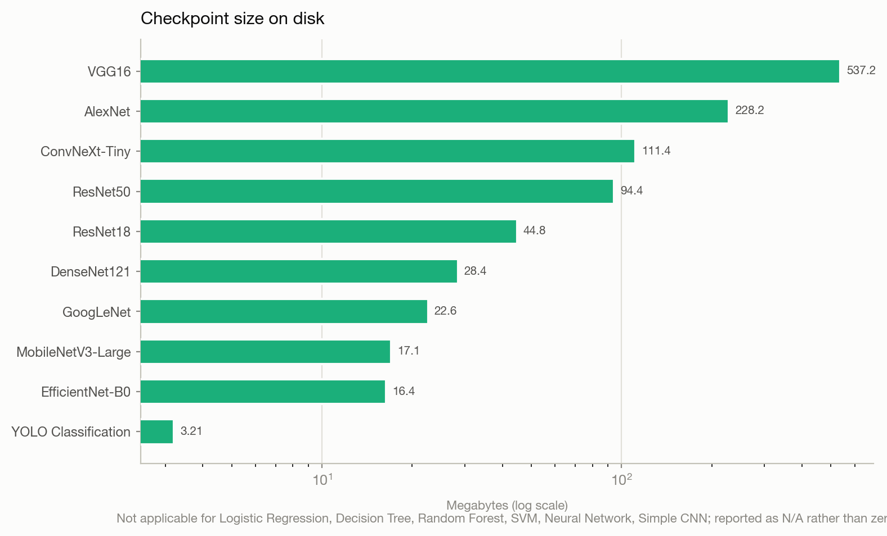

### Training time

Log scale, and the traditional models are included — the contrast between seconds and minutes is part of the trade-off.

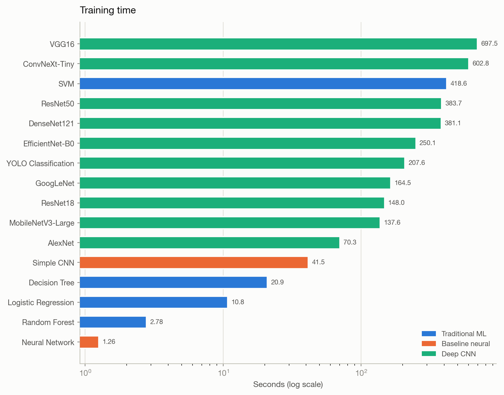

### Inference throughput

Batched images per second. The traditional models' throughput is derived from the latency Part 1 measured.

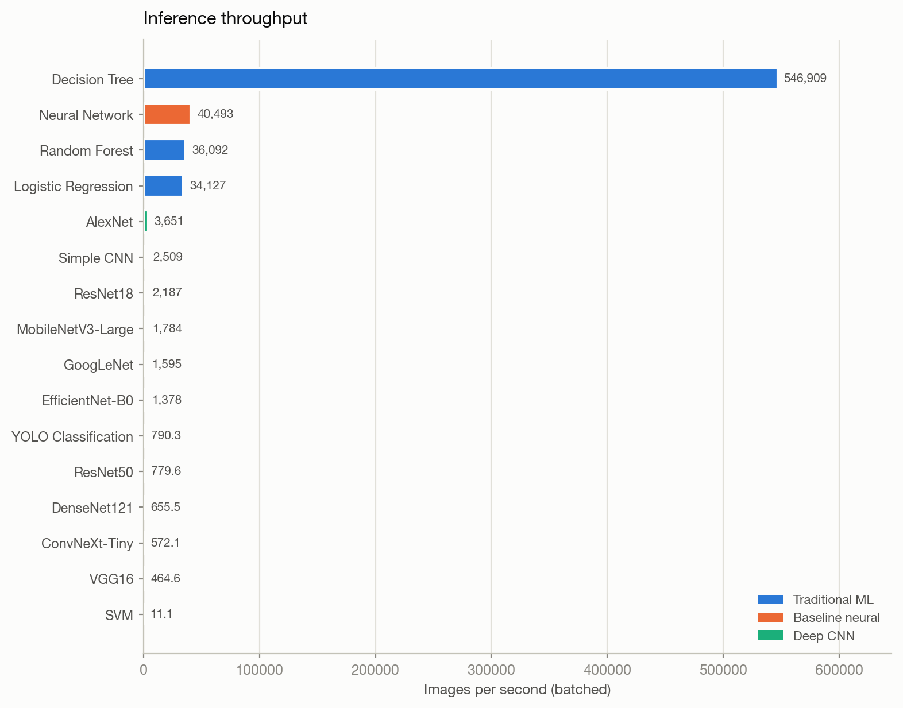

### The two trade-off plots

These are the figures the deployment argument actually rests on, because they put accuracy against what accuracy costs. Every point is labeled directly rather than through a legend — sixteen points identified only by color would not be readable.

#### Accuracy against parameter count

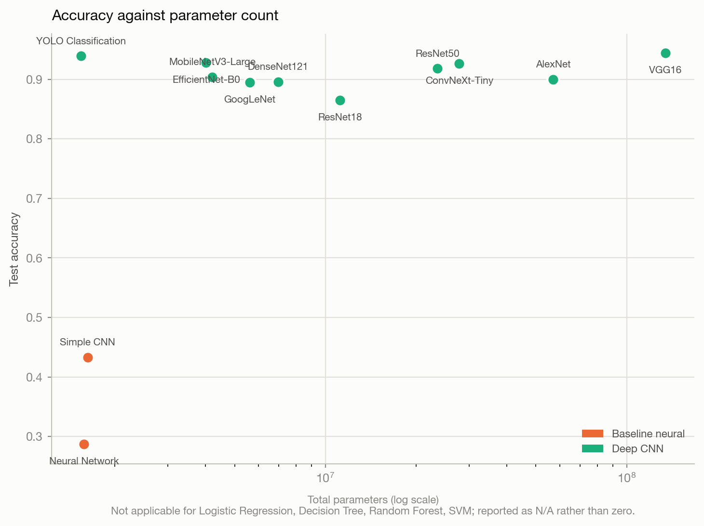

#### Accuracy against inference latency

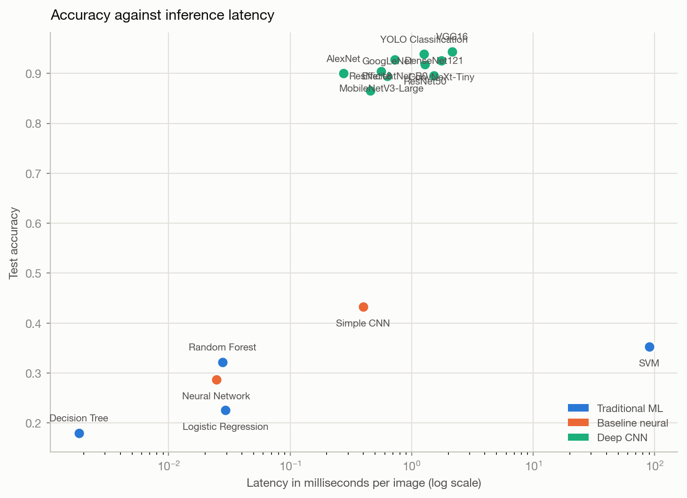

The shape to look for in both is the knee: the point past which additional parameters or additional latency stop buying meaningful accuracy. Where that knee falls, rather than which model sits highest, is what should decide an architecture for a given deployment.

## 13. Required final rankings

### Ranking A — highest accuracy

Test accuracy on the shared test half, highest first.

| Rank | Model | Family | Value |
|---|---|---|---|
| 1 | VGG16 | Deep CNN | 0.9440 |
| 2 | YOLO Classification | Modern Classifier | 0.9390 |
| 3 | EfficientNet-B0 | Scaled CNN | 0.9280 |
| 4 | ConvNeXt-Tiny | Modern CNN | 0.9260 |
| 5 | ResNet50 | Residual CNN | 0.9180 |
| 6 | MobileNetV3-Large | Efficient CNN | 0.9040 |
| 7 | AlexNet | Deep CNN | 0.9000 |
| 8 | DenseNet121 | Dense CNN | 0.8960 |
| 9 | GoogLeNet | Multi-branch CNN | 0.8950 |
| 10 | ResNet18 | Residual CNN | 0.8650 |
| 11 | Simple CNN | CNN Baseline | 0.4330 |
| 12 | SVM | Traditional ML | 0.3530 |
| 13 | Random Forest | Traditional ML | 0.3220 |
| 14 | Neural Network | Neural Baseline | 0.2870 |
| 15 | Logistic Regression | Traditional ML | 0.2260 |
| 16 | Decision Tree | Traditional ML | 0.1800 |

### Ranking B — fastest inference

Batched throughput in images per second, highest first. Traditional ML throughput is derived from the latency Part 1 measured.

| Rank | Model | Family | Value |
|---|---|---|---|
| 1 | Decision Tree | Traditional ML | 546908.9 |
| 2 | Neural Network | Neural Baseline | 40492.8 |
| 3 | Random Forest | Traditional ML | 36092.3 |
| 4 | Logistic Regression | Traditional ML | 34127.1 |
| 5 | AlexNet | Deep CNN | 3650.9 |
| 6 | Simple CNN | CNN Baseline | 2508.9 |
| 7 | ResNet18 | Residual CNN | 2187.0 |
| 8 | MobileNetV3-Large | Efficient CNN | 1783.8 |
| 9 | GoogLeNet | Multi-branch CNN | 1594.8 |
| 10 | EfficientNet-B0 | Scaled CNN | 1378.3 |
| 11 | YOLO Classification | Modern Classifier | 790.3 |
| 12 | ResNet50 | Residual CNN | 779.6 |
| 13 | DenseNet121 | Dense CNN | 655.5 |
| 14 | ConvNeXt-Tiny | Modern CNN | 572.1 |
| 15 | VGG16 | Deep CNN | 464.6 |
| 16 | SVM | Traditional ML | 11.1 |

### Ranking C — smallest model

Saved checkpoint size in MB, smallest first. Only models that write a checkpoint appear.

| Rank | Model | Family | Value |
|---|---|---|---|
| 1 | YOLO Classification | Modern Classifier | 3.21 |
| 2 | EfficientNet-B0 | Scaled CNN | 16.36 |
| 3 | MobileNetV3-Large | Efficient CNN | 17.05 |
| 4 | GoogLeNet | Multi-branch CNN | 22.61 |
| 5 | DenseNet121 | Dense CNN | 28.43 |
| 6 | ResNet18 | Residual CNN | 44.80 |
| 7 | ResNet50 | Residual CNN | 94.42 |
| 8 | ConvNeXt-Tiny | Modern CNN | 111.37 |
| 9 | AlexNet | Deep CNN | 228.18 |
| 10 | VGG16 | Deep CNN | 537.22 |

### Ranking D — accuracy per million parameters

Accuracy divided by parameters in millions. A comparative indicator only — it rewards small models heavily and is not a measure of model quality.

| Rank | Model | Accuracy | Parameters (M) | Accuracy per M |
|---|---|---|---|---|
| 1 | YOLO Classification | 0.9390 | 1.544 | 0.6082 |
| 2 | EfficientNet-B0 | 0.9280 | 4.020 | 0.2308 |
| 3 | MobileNetV3-Large | 0.9040 | 4.215 | 0.2145 |
| 4 | GoogLeNet | 0.8950 | 5.610 | 0.1595 |
| 5 | DenseNet121 | 0.8960 | 6.964 | 0.1287 |
| 6 | ResNet18 | 0.8650 | 11.182 | 0.0774 |
| 7 | ResNet50 | 0.9180 | 23.529 | 0.0390 |
| 8 | ConvNeXt-Tiny | 0.9260 | 27.828 | 0.0333 |
| 9 | AlexNet | 0.9000 | 57.045 | 0.0158 |
| 10 | VGG16 | 0.9440 | 134.302 | 0.0070 |

### Ranking E — overall, every model

Every model in the benchmark scored on the three metrics all of them report. Accuracy 40% and macro F1 35% because the task is classification and being right dominates; macro F1 is weighted separately from accuracy because it is the one that catches a model quietly abandoning a class. Latency 25% because a classifier too slow for its deployment is not a usable classifier. Metrics are min-max normalized across the models scored, so the numbers are relative to this benchmark and not absolute.

**Weighting:** accuracy 40%, macro f1 35%, latency ms 25%

| Rank | Model | Family | Score |
|---|---|---|---|
| 1 | EfficientNet-B0 | Scaled CNN | 0.8459 |
| 2 | YOLO Classification | Modern Classifier | 0.8438 |
| 3 | AlexNet | Deep CNN | 0.8410 |
| 4 | VGG16 | Deep CNN | 0.8364 |
| 5 | MobileNetV3-Large | Efficient CNN | 0.8280 |
| 6 | ConvNeXt-Tiny | Modern CNN | 0.8235 |
| 7 | ResNet50 | Residual CNN | 0.8229 |
| 8 | GoogLeNet | Multi-branch CNN | 0.8169 |
| 9 | DenseNet121 | Dense CNN | 0.7971 |
| 10 | ResNet18 | Residual CNN | 0.7942 |
| 11 | Simple CNN | CNN Baseline | 0.3740 |
| 12 | Random Forest | Traditional ML | 0.3249 |
| 13 | Neural Network | Neural Baseline | 0.2921 |
| 14 | Decision Tree | Traditional ML | 0.2500 |
| 15 | Logistic Regression | Traditional ML | 0.2305 |
| 16 | SVM | Traditional ML | 0.1693 |

### Ranking E — edge deployment score

The edge-deployment score, for models that report size and memory. Accuracy 30% and macro F1 25% keep correctness dominant at 55%. Throughput 20% and checkpoint size 15% are the two constraints that actually stop a model shipping to a UAV or an embedded board — flash budget and frame rate. Memory is weighted lowest at 10% because on this host it is a sampled MPS allocation rather than a true peak, and a weight should not exceed the confidence in its measurement. Throughput, checkpoint size and memory are normalized on a log scale for the same reason latency is in the universal score; accuracy and macro F1 are normalized directly.

**Weighting:** accuracy 30%, macro f1 25%, throughput 20%, checkpoint mb 15%, memory mb 10%

| Rank | Model | Family | Score |
|---|---|---|---|
| 1 | EfficientNet-B0 | Scaled CNN | 0.7450 |
| 2 | MobileNetV3-Large | Efficient CNN | 0.6254 |
| 3 | AlexNet | Deep CNN | 0.5824 |
| 4 | ConvNeXt-Tiny | Modern CNN | 0.5583 |
| 5 | VGG16 | Deep CNN | 0.5500 |
| 6 | GoogLeNet | Multi-branch CNN | 0.5483 |
| 7 | ResNet50 | Residual CNN | 0.5478 |
| 8 | DenseNet121 | Dense CNN | 0.4102 |
| 9 | ResNet18 | Residual CNN | 0.3356 |

Two scores rather than one, because not every model reports every metric. The universal score uses the three metrics every model reports, so all of them can be ranked on the same basis. The deployment score adds checkpoint size and memory, which only the models that write a checkpoint and were profiled in this environment have, and weights them for an embedded target. A single score that renormalized its weights whenever a measurement was missing would produce an order that depended on which measurements happened to be possible, which is worse than reporting two honest scores.

**Absent from the deployment score:** **Decision Tree**, **Logistic Regression**, **Neural Network**, **Random Forest**, **SVM**, **Simple CNN**, **YOLO Classification**. They appear in every other ranking and in the master table; they are excluded here only because the memory measurement this score depends on was not taken for them. YOLO trains in a separate virtual environment and reports its own figures, and profiling it with this project's hooks would mean measuring a different process under different library versions — which would not be comparable with the numbers beside it. Absence here means unmeasured, not last.

All metrics are min-max normalized across the models being scored, so these numbers are relative to this benchmark and carry no absolute meaning.

## 14. Per-class performance

Per-class F1 for every model that produced results. The question section 15 asks is not which model is best but whether the deeper architectures actually fix the errors the shallow ones made, or merely make the same mistakes less often.

| Class | Logistic Regression | Decision Tree | Random Forest | SVM | Neural Network | Simple CNN | AlexNet | VGG16 | GoogLeNet | ResNet18 | ResNet50 | DenseNet121 | MobileNetV3-Large | EfficientNet-B0 | ConvNeXt-Tiny | YOLO Classification |
|---|---|---|---|---|---|---|---|---|---|---|---|---|---|---|---|---|
| butterfly | 0.2105 | 0.2273 | 0.4299 | 0.4976 | 0.3628 | 0.6369 | 0.9246 | 0.97 | 0.9463 | 0.9268 | 0.9505 | 0.9366 | 0.9261 | 0.9394 | 0.9703 | 0.9552 |
| cat | 0.2178 | 0.0933 | 0.2556 | 0.2902 | 0.2366 | 0.3737 | 0.8973 | 0.9548 | 0.9286 | 0.8571 | 0.9216 | 0.8646 | 0.8848 | 0.9146 | 0.9453 | 0.9447 |
| chicken | 0.2198 | 0.1872 | 0.3188 | 0.3636 | 0.24 | 0.4951 | 0.95 | 0.9706 | 0.9637 | 0.9231 | 0.934 | 0.9442 | 0.9447 | 0.9552 | 0.949 | 0.9652 |
| cow | 0.2431 | 0.1753 | 0.3012 | 0.2738 | 0.2938 | 0.4157 | 0.8447 | 0.8986 | 0.8364 | 0.8073 | 0.8889 | 0.8651 | 0.8634 | 0.9216 | 0.8587 | 0.9064 |
| dog | 0.0909 | 0.1435 | 0.2086 | 0.2625 | 0.1429 | 0.209 | 0.8889 | 0.9231 | 0.8614 | 0.8085 | 0.89 | 0.828 | 0.8352 | 0.8867 | 0.9016 | 0.9045 |
| elephant | 0.2661 | 0.2617 | 0.2917 | 0.2667 | 0.2304 | 0.4468 | 0.9746 | 0.9703 | 0.8681 | 0.9366 | 0.936 | 0.9347 | 0.9756 | 0.9534 | 0.9655 | 0.951 |
| horse | 0.2644 | 0.1611 | 0.383 | 0.4255 | 0.3442 | 0.4216 | 0.839 | 0.9388 | 0.8531 | 0.8235 | 0.8808 | 0.8531 | 0.8768 | 0.8966 | 0.8976 | 0.9184 |
| sheep | 0.2927 | 0.2292 | 0.3756 | 0.4231 | 0.3964 | 0.4348 | 0.829 | 0.8856 | 0.8511 | 0.8136 | 0.8958 | 0.8842 | 0.8598 | 0.9064 | 0.8767 | 0.9 |
| spider | 0.2747 | 0.1456 | 0.3214 | 0.4262 | 0.3585 | 0.5507 | 0.93 | 0.9641 | 0.9293 | 0.9073 | 0.95 | 0.9293 | 0.9453 | 0.9557 | 0.9474 | 0.9749 |
| squirrel | 0.1719 | 0.1782 | 0.3021 | 0.2911 | 0.2069 | 0.3516 | 0.9246 | 0.9652 | 0.9171 | 0.8393 | 0.9326 | 0.9179 | 0.9223 | 0.9534 | 0.9469 | 0.9697 |

### The classes everything finds hard

Averaged across every model in the benchmark, the three hardest classes are **dog** (0.612), **cow** (0.650), **cat** (0.661), and the three easiest are **butterfly** (0.738), **spider** (0.719), **chicken** (0.708).

Set side by side, the question becomes answerable:

| Class | Traditional ML mean F1 | Deep CNN mean F1 | Improvement |
|---|---|---|---|
| sheep | 0.3302 | 0.8702 | 0.54 |
| horse | 0.3085 | 0.8778 | 0.5693 |
| butterfly | 0.3413 | 0.9446 | 0.6033 |
| cow | 0.2484 | 0.8691 | 0.6207 |
| spider | 0.292 | 0.9433 | 0.6513 |
| elephant | 0.2716 | 0.9466 | 0.675 |
| chicken | 0.2724 | 0.95 | 0.6776 |
| squirrel | 0.2358 | 0.9289 | 0.6931 |
| dog | 0.1764 | 0.8728 | 0.6964 |
| cat | 0.2142 | 0.9113 | 0.6971 |

The answer is unambiguous: **every class improved**, by between 0.54 and 0.70 F1. Not one class resisted the deep architectures while yielding to the traditional ones, and the smallest improvement — **sheep**, up 0.54 — is still larger than the entire spread between the best and worst traditional classifier. The difficulty the traditional models had was not concentrated in a few confusable classes that better features would also struggle with; it was a uniform inability to represent any of these categories from raw pixels.

What remains hardest for the deep architectures is **cow** at 0.869 mean F1. That it is also among the hardest classes for the traditional models suggests genuine visual ambiguity or label noise rather than a representational limit — Animals-10 is assembled from web images, and the dog, cat and cow categories in particular contain photographs with several animals in frame.

## 15. Convergence and overfitting

Read from the curves rather than by eye. Three quantities, each chosen to be checkable: the generalization gap is final training accuracy minus final validation accuracy; the validation loss rise is how far validation loss climbed above its own minimum by the last epoch; and epochs after best counts how much of the training budget ran after the selected checkpoint.

| Architecture | Best epoch | Best val accuracy | Final train acc | Final val acc | Generalization gap | Val loss rise | Epochs after best |
|---|---|---|---|---|---|---|---|
| ResNet18 | 9 | 0.8717 | 0.9406 | 0.8067 | +0.1339 | +0.2070 | 11 |
| AlexNet | 13 | 0.8933 | 0.9929 | 0.8817 | +0.1113 | +0.1349 | 7 |
| MobileNetV3-Large | 18 | 0.9083 | 0.9947 | 0.8917 | +0.1030 | +0.0450 | 2 |
| ConvNeXt-Tiny | 1 | 0.9367 | 0.9865 | 0.8950 | +0.0915 | +0.2938 | 19 |
| DenseNet121 | 18 | 0.9050 | 0.9438 | 0.8533 | +0.0905 | +0.1924 | 2 |
| GoogLeNet | 13 | 0.9100 | 0.9735 | 0.8867 | +0.0869 | +0.1090 | 7 |
| ResNet50 | 18 | 0.9200 | 0.9968 | 0.9117 | +0.0851 | +0.0759 | 2 |
| VGG16 | 15 | 0.9483 | 0.9959 | 0.9383 | +0.0575 | +0.0836 | 5 |
| EfficientNet-B0 | 13 | 0.9300 | 0.9750 | 0.9217 | +0.0533 | +0.0450 | 7 |
| YOLO Classification | 20 | 0.9300 | N/A | 0.9300 | N/A | +0.0000 | 0 |

A large positive generalization gap with a rising validation loss is the textbook overfitting signature, and a model whose best epoch came early and then trained for many more epochs was overfitting for most of its budget. Because no architecture uses early stopping, these curves show the overfitting rather than hiding it behind a truncated run — which is what makes the comparison of training cost in section 19 meaningful, since every architecture paid for the same twenty epochs.

Two readings stand out. **ConvNeXt-Tiny selected epoch 1** and then trained for nineteen more, with validation loss rising 0.29 above its minimum while training loss kept falling. Its ImageNet features were already better suited to this problem than anything twenty epochs of fine-tuning at this learning rate produced; the remaining nineteen epochs did measurable harm. It still finished second on accuracy, because the checkpoint that was kept is the epoch-1 one — which is precisely what section 12's selection rule is for.

**Every architecture trained here overfit, and the one trained elsewhere did not.** YOLO is the only entry whose best epoch is its last, with no validation loss rise at all and accuracy still climbing when the budget ran out. It is also the only one not trained through this project's transform pipeline: ultralytics applies RandAugment, random erasing, HSV jitter, scaling and translation by default, where section 7 specifies a resize, a random crop and a horizontal flip. That is a confound rather than a result — YOLO's freedom from overfitting is at least partly its augmentation rather than its architecture — but it points at something real: on 3,400 training images the augmentation prescribed here is light enough that nine of ten architectures exhausted it within a handful of epochs.

### Per-architecture curves

**AlexNet**

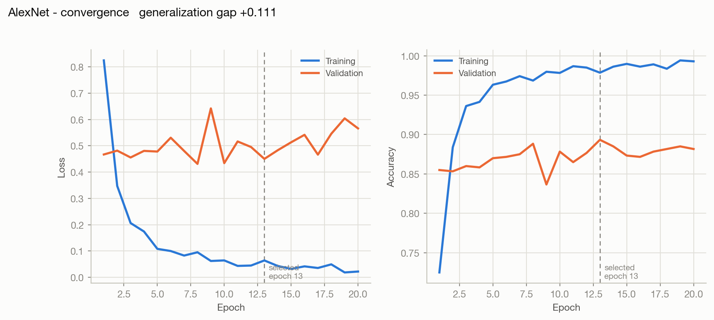

**VGG16**

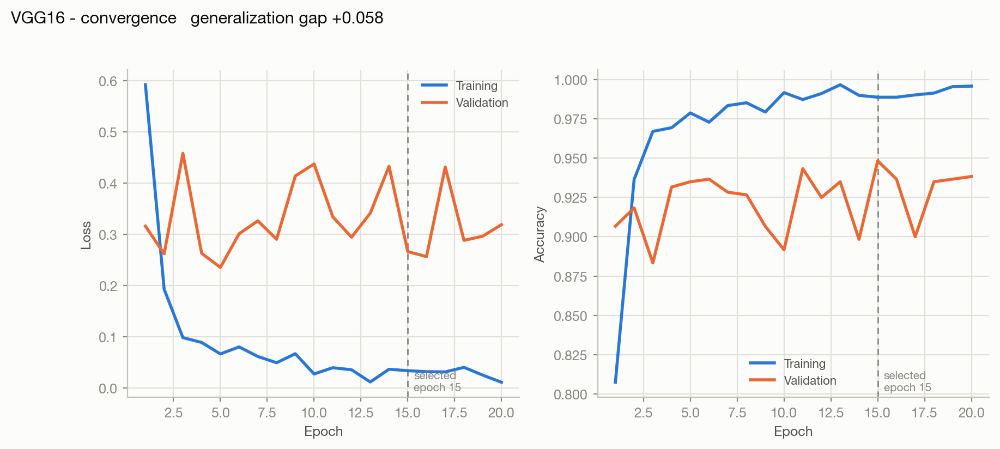

**GoogLeNet**

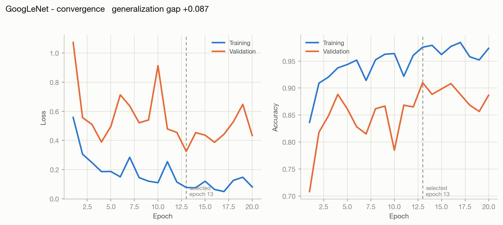

**ResNet18**

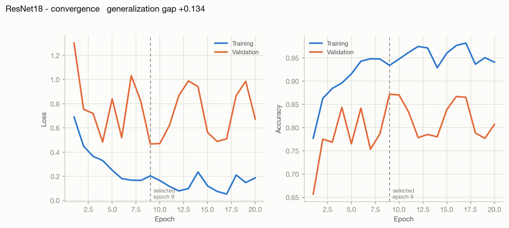

**ResNet50**

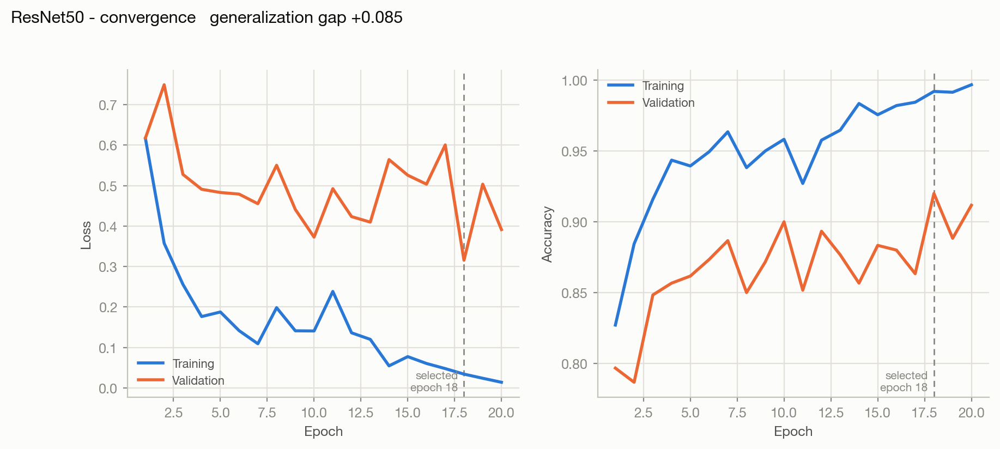

**DenseNet121**

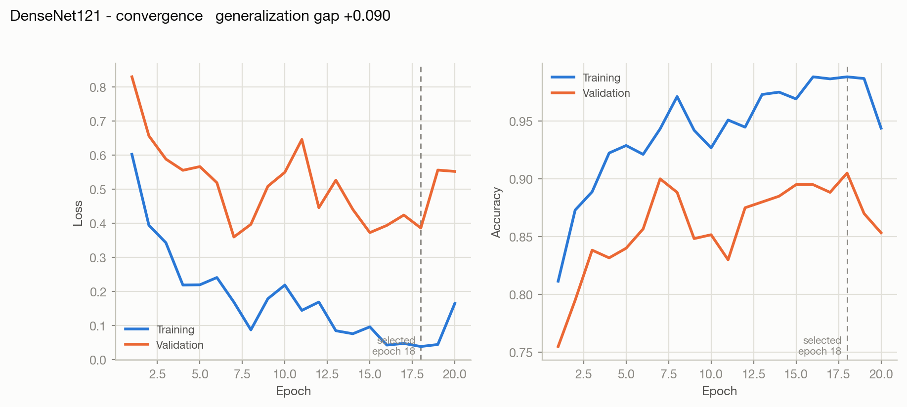

**MobileNetV3-Large**

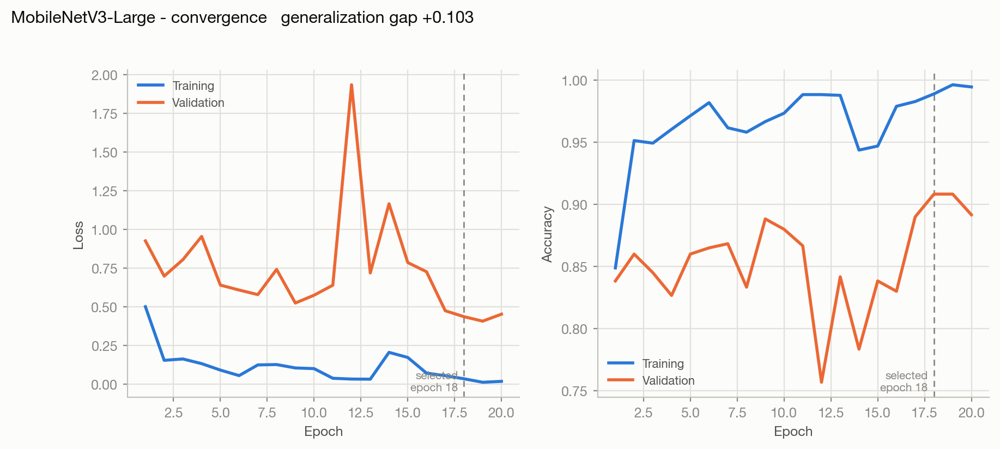

**EfficientNet-B0**

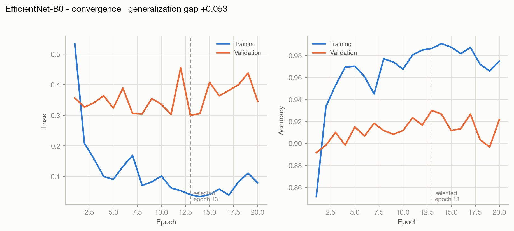

**ConvNeXt-Tiny**

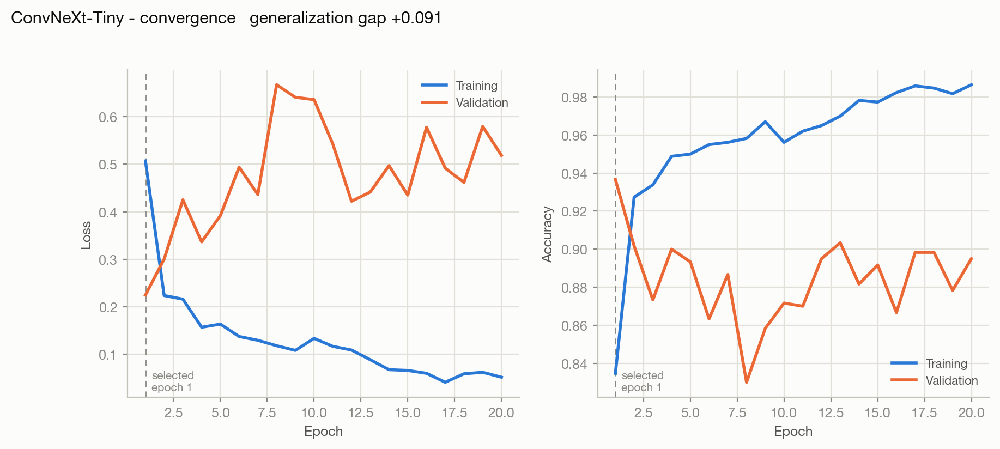

**YOLO Classification**

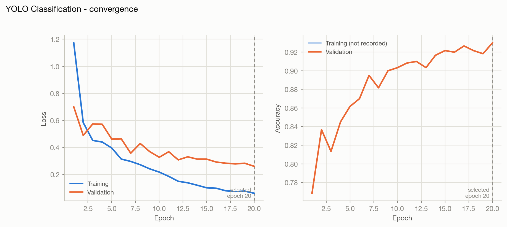

## 16. Cost: parameters, size, complexity, time and memory

### Parameters, storage and computational complexity

| Architecture | Total parameters | Trainable parameters | Checkpoint (MB) | GMACs | GFLOPs (2x MACs) |
|---|---|---|---|---|---|
| AlexNet | 57,044,810 | 57,044,810 | 228.18 | 0.71 | 1.42 |
| VGG16 | 134,301,514 | 134,301,514 | 537.22 | 15.466 | 30.932 |
| GoogLeNet | 5,610,154 | 5,610,154 | 22.61 | 1.504 | 3.008 |
| ResNet18 | 11,181,642 | 11,181,642 | 44.8 | 1.819 | 3.637 |
| ResNet50 | 23,528,522 | 23,528,522 | 94.42 | 4.109 | 8.219 |
| DenseNet121 | 6,964,106 | 6,964,106 | 28.43 | 2.865 | 5.729 |
| MobileNetV3-Large | 4,214,842 | 4,214,842 | 17.05 | 0.225 | 0.45 |
| EfficientNet-B0 | 4,020,358 | 4,020,358 | 16.36 | 0.4 | 0.801 |
| ConvNeXt-Tiny | 27,827,818 | 27,827,818 | 111.37 | 4.47 | 8.939 |
| YOLO Classification | 1,543,914 | 0 | 3.21 | N/A | N/A |

Total and trainable parameters are equal for every architecture because the protocol fine-tunes all layers. That is worth showing rather than collapsing into one column: a reader comparing these against a frozen-backbone benchmark elsewhere needs to see which regime produced them.

The complexity column needs one clarification that the tooling makes easy to get wrong. Both profilers available here count multiply-accumulate operations and then label the total `flops`. A MAC is a multiply and an add, so the floating-point operation count is about twice the reported figure. Reporting the profiler's number under a FLOPs heading would understate every architecture by a factor of two, so MACs are reported as MACs and FLOPs are derived explicitly. The operators the profiler could not account for — pooling and elementwise activations — carry no multiply-accumulates, so the totals are not meaningfully understated; the per-architecture list of them is in `deep_metrics.json`.

### Training time, inference speed and memory

| Architecture | Total training (s) | Seconds per epoch | Batched latency (ms/img) | Throughput (img/s) | Single-image latency (ms) | Memory (MB) |
|---|---|---|---|---|---|---|
| AlexNet | 70.3 | 3.51 | 0.2739 | 3650.89 | 1.077 | 328.2 |
| VGG16 | 697.5 | 34.87 | 2.1523 | 464.62 | 4.025 | 2219.9 |
| GoogLeNet | 164.5 | 8.22 | 0.6271 | 1594.75 | 5.6768 | 472.1 |
| ResNet18 | 148.0 | 7.4 | 0.4572 | 2187.01 | 2.0889 | 494.3 |
| ResNet50 | 383.7 | 19.16 | 1.2826 | 779.65 | 4.9797 | 800.8 |
| DenseNet121 | 381.1 | 19.02 | 1.5255 | 655.52 | 14.3461 | 1152.2 |
| MobileNetV3-Large | 137.6 | 6.86 | 0.5606 | 1783.81 | 5.2295 | 517.9 |
| EfficientNet-B0 | 250.1 | 12.49 | 0.7255 | 1378.32 | 6.1503 | 857.6 |
| ConvNeXt-Tiny | 602.8 | 30.14 | 1.7479 | 572.12 | 2.7446 | 920.6 |
| YOLO Classification | 207.6 | 10.18 | 1.2654 | 790.29 | N/A | N/A |

Latency is reported at two batch sizes because they answer different questions. Batched throughput is what a server sees and flatters every architecture, since a batch of 64 keeps the device busy in a way a single frame never does. Single-image latency is what a drone or a phone pays when it classifies one frame as it arrives, and it is the figure the deployment recommendation below is argued from. Both were measured after an untimed warm-up, because the first batches through a freshly loaded network pay for lazy kernel compilation that belongs to startup rather than to the architecture.

### Memory, and why the obvious measurement was useless twice

This metric took three attempts, and the first two are instructive because both produced numbers that looked entirely reasonable.

The first read `driver_allocated_memory`, the process-wide allocator pool. It grows as models load and is never handed back, so across a nine-architecture run it produced a column that rose monotonically in run order — the first architecture at 2.4 GB and every later one between 12 and 15 GB regardless of size. Those numbers described the order the architectures ran in.

The second sampled live tensor allocation between batches. That is a real quantity, but the wrong one: after a forward pass under `no_grad` every intermediate tensor has already been released, so what remains is the weights. Measured that way, memory correlated with checkpoint size at r = 1.000 to within 0.23 MB across all nine architectures. It was a second copy of the model-size column wearing a different heading, and it would have carried its own weight in the deployment ranking as though it were independent information.

The third samples allocation *inside* the forward pass, through a hook on every submodule, and keeps the maximum. That measures the working set: the weights plus the largest set of intermediate tensors alive at one time, which is what a deployment target actually has to fit. It correlates with checkpoint size at r = 0.75 rather than 1.00, and the difference is where the finding is.

| Architecture | Weights (MB) | Activations (MB) | Peak working set (MB) | Activations / weights |
|---|---|---|---|---|
| VGG16 | 537.2 | 1682.7 | 2219.9 | 3.1x |
| DenseNet121 | 28.2 | 1123.9 | 1152.2 | 39.9x |
| EfficientNet-B0 | 16.3 | 841.4 | 857.6 | 51.6x |
| ConvNeXt-Tiny | 111.3 | 809.2 | 920.6 | 7.3x |
| ResNet50 | 94.3 | 706.5 | 800.8 | 7.5x |
| MobileNetV3-Large | 17.0 | 501.0 | 517.9 | 29.5x |
| GoogLeNet | 22.5 | 449.6 | 472.1 | 20.0x |
| ResNet18 | 44.8 | 449.6 | 494.3 | 10.0x |
| AlexNet | 228.2 | 100.0 | 328.2 | 0.4x |

**The efficient architectures are not memory-efficient.** EfficientNet-B0 holds 16 MB of weights and needs roughly 840 MB of activations to run a batch — about fifty times its own size. MobileNetV3-Large is nearly thirty times, DenseNet121 close to forty. AlexNet, the largest model here by weight after VGG16, has the *smallest* activation footprint of all nine, at 0.4 times its weights.

The mechanism is straightforward once stated. Depthwise separable convolutions and inverted bottlenecks cut parameters by factorizing the convolution, but they keep feature maps wide and at high spatial resolution through much of the network, and it is feature maps that occupy memory at inference. DenseNet's concatenation is the same trade made explicit: feature reuse means every earlier layer's output stays alive to be concatenated, which is exactly why it needs so few parameters and so much memory. AlexNet goes the other way — an 11x11 stride-4 first convolution collapses the spatial dimensions almost immediately, and its parameters sit in dense layers operating on already-small feature maps.

This matters for the deployment question and cuts against the obvious reading of the model-size ranking. An embedded target with 256 MB of usable memory cannot run EfficientNet-B0 at batch 64, despite its 16 MB checkpoint fitting comfortably in flash. Choosing on checkpoint size alone would pick a model that does not fit, and the reason it does not fit is invisible in every metric the assignment's table asks for except this one. Reducing the batch size reduces the activation footprint roughly proportionally, which is the lever an embedded deployment actually has — but that is a deployment decision the benchmark's fixed batch size of 64 does not explore.

## 17. Architecture evolution

Each generation in this benchmark was a response to a specific limitation of the one before it. Read in order, the list is an argument about what the field learned.

### AlexNet (2012) — Deep CNN

**Main ideas:** ReLU activations instead of saturating nonlinearities; dropout in the fully connected layers; large early convolution kernels (11x11 stride 4); GPU training at ImageNet scale.

**What it addressed:** Showed that deep CNNs beat hand-engineered features, which is the result that ended the feature-engineering era.

**In this benchmark:** 90.0% test accuracy with 57,044,810 parameters, 228.18 MB on disk.

### VGG16 (2014) — Deep CNN

**Main ideas:** stacked 3x3 convolutions in place of large kernels; uniform, very deep sequential design; very large parameter count concentrated in the dense layers.

**What it addressed:** Replaced AlexNet's large kernels with stacks of small ones, gaining depth and receptive field at lower parameter cost per layer — but ballooning the fully connected head.

**In this benchmark:** 94.4% test accuracy with 134,301,514 parameters, 537.22 MB on disk.

### GoogLeNet (2014) — Multi-branch CNN

**Main ideas:** Inception modules with parallel branches; several receptive-field sizes in one layer; 1x1 convolutions as cheap dimensionality reduction; global average pooling instead of a huge dense head.

**What it addressed:** Attacked VGG's parameter cost directly: width and multi-scale features instead of depth alone, at a fraction of the parameters.

**In this benchmark:** 89.5% test accuracy with 5,610,154 parameters, 22.61 MB on disk.

### ResNet18 (2015) — Residual CNN

**Main ideas:** residual connections; identity skip paths that preserve gradient flow; batch normalization throughout.

**What it addressed:** Solved the degradation problem: past roughly twenty layers, plain deep networks got *worse*, and skip connections made depth trainable again.

**In this benchmark:** 86.5% test accuracy with 11,181,642 parameters, 44.8 MB on disk.

### ResNet50 (2015) — Residual CNN

**Main ideas:** bottleneck residual blocks (1x1, 3x3, 1x1); greater depth at controlled parameter cost; the same identity skip paths as ResNet18.

**What it addressed:** Shows what depth buys inside one architectural family, which is why the assignment pairs it with ResNet18.

**In this benchmark:** 91.8% test accuracy with 23,528,522 parameters, 94.42 MB on disk.

### DenseNet121 (2016) — Dense CNN

**Main ideas:** dense connectivity — every layer sees all earlier feature maps; feature reuse rather than feature relearning; narrow layers, so parameters stay low despite the connectivity.

**What it addressed:** Took ResNet's skip idea further: concatenate rather than add, so features are reused instead of recomputed.

**In this benchmark:** 89.6% test accuracy with 6,964,106 parameters, 28.43 MB on disk.

### MobileNetV3-Large (2019) — Efficient CNN

**Main ideas:** depthwise separable convolutions; inverted residuals with linear bottlenecks; squeeze-and-excitation attention; architecture search tuned for mobile latency, not just FLOPs.

**What it addressed:** Reframed the goal from accuracy to accuracy per millisecond on a phone, which is the question this benchmark's deployment discussion actually asks.

**In this benchmark:** 90.4% test accuracy with 4,214,842 parameters, 17.05 MB on disk.

### EfficientNet-B0 (2019) — Scaled CNN

**Main ideas:** compound scaling of depth, width and resolution together; mobile inverted bottleneck blocks; a scaling rule rather than a hand-tuned family.

**What it addressed:** Showed that depth, width and input resolution should be scaled jointly — scaling one alone saturates.

**In this benchmark:** 92.8% test accuracy with 4,020,358 parameters, 16.36 MB on disk.

### ConvNeXt-Tiny (2022) — Modern CNN

**Main ideas:** transformer-inspired design kept fully convolutional; large 7x7 depthwise kernels; LayerNorm in place of BatchNorm, GELU in place of ReLU; inverted bottleneck with fewer, wider blocks.

**What it addressed:** Answered whether vision transformers won because of attention or because of their training recipe and design choices — a modernized CNN matches them.

**In this benchmark:** 92.6% test accuracy with 27,827,818 parameters, 111.37 MB on disk.

### YOLO Classification (2024) — Modern Classifier

**Main ideas:** a detection-family backbone run in classification mode; anchor-free, single-pass design inherited from detection; aggressive built-in augmentation and its own training recipe; engineered for deployment throughput rather than benchmark accuracy alone.

**What it addressed:** Tests whether a model family designed for real-time detection is competitive at plain image classification, which is what an edge deployment would actually have to choose between.

**In this benchmark:** 93.9% test accuracy with 1,543,914 parameters, 3.21 MB on disk.

### The timeline

```
Logistic Regression / Decision Tree / Random Forest / SVM
   |   no notion of locality; a pixel is just a column
   v
MLP / Simple CNN
   |   convolution introduces locality and weight sharing
   v
AlexNet (2012)      ReLU, dropout, large kernels, GPU scale
   |   hand-engineered features are finished
   v
VGG (2014)          stacks of 3x3 convolutions, uniform depth
   |   depth is good, but the dense head is enormous
   v
GoogLeNet (2014)    Inception modules, 1x1 reduction, global pooling
   |   width and multi-scale features at a fraction of the parameters
   v
ResNet (2015)       residual connections
   |   depth past ~20 layers becomes trainable at all
   v
DenseNet (2016)     dense connectivity, feature reuse
   |   concatenate instead of add; reuse instead of relearn
   v
MobileNet (2019)    depthwise separable convolutions
   |   the goal becomes accuracy per millisecond on a phone
   v
EfficientNet (2019) compound scaling of depth, width, resolution
   |   scale the three together rather than one at a time
   v
ConvNeXt (2022)     transformer-inspired, still convolutional
   |   the training recipe and design mattered, not just attention
   v
YOLO classification a detection backbone in classification mode
```

## 18. Which architecture, for which deployment

The assignment's closing point is that architecture selection is not a question of which model scores highest. This benchmark makes that concrete: the most accurate architecture, the smallest, and the fastest are three different models, and the gaps between them in accuracy are far smaller than the gaps in cost.

| Criterion | Architecture | Figure |
|---|---|---|
| Highest accuracy | VGG16 | 94.4% accuracy |
| Smallest checkpoint | YOLO Classification | 3.21 MB, 93.9% accuracy |
| Fastest inference | AlexNet | 3650.9 img/s, 90.0% accuracy |
| Best deployment score | EfficientNet-B0 | score 0.7450 |

### Recommendations by target

**Server or workstation, accuracy is the objective.** **VGG16** at 94.4%. Its 537.22 MB checkpoint and its position as the slowest model in the benchmark are close to free in this setting, where the batch is large and the hardware is not the constraint. It is worth noticing that the winner on raw accuracy is a 2014 architecture, and that it only wins once its learning rate is corrected — at the prescribed rate it finished near the bottom of the table.

**UAV or embedded board, hard latency and memory budget.** **EfficientNet-B0** tops the deployment score, and the accuracy-against-latency plot is the figure to argue from. But the constraint that actually decides this case is the one the assignment's table does not ask for. EfficientNet-B0 holds 16 MB of weights and needs a 858 MB working set at batch 64 — the efficient architectures are efficient in parameters, not in memory. A board chosen on checkpoint size alone will not run them.

Both of those constraints point at the same architecture, and it is not the deployment-score winner: **AlexNet** has the smallest working set at 328 MB *and* the lowest single-image latency at 1.08 ms. That is the same property seen from two directions. Its 11x11 stride-4 first convolution collapses the spatial dimensions almost immediately, so there is little feature map left to store or to process, and its parameters sit in dense layers that are cheap to evaluate once. The oldest architecture in the benchmark is the one best suited to the tightest hardware — provided its learning rate is corrected, without which it does not train at all.

On a real embedded target the binding constraint decides the architecture, and which constraint binds is a property of the board rather than of the benchmark. Reducing the batch size cuts the activation footprint roughly proportionally and is the lever an embedded deployment actually has, but the fixed batch size of 64 in this protocol does not explore it.

**Mobile application.** Checkpoint size joins latency as a real constraint, because the model ships inside the application bundle. **YOLO Classification** at 3.21 MB and 93.9% accuracy gives up 0.5% against the most accurate model for roughly 167x less storage, which is the trade almost any mobile deployment should take.

**A note on what this benchmark does not settle.** Every deep architecture here started from ImageNet weights, and the ten Animals-10 classes are all well represented in ImageNet. That makes this a favorable transfer-learning setting, and the margin over the traditional baselines should be read with that in mind — it measures convolution plus transfer learning together, not convolution alone. A from-scratch comparison would separate the two, and the framework supports it through `--no-pretrained`, but it is not the experiment the assignment specified and it was not run.

## 19. Reflection

The result that changed how I think about this assignment came from running the
benchmark twice. At a hundred images per class the CNN and the Random Forest were
indistinguishable, 0.295 against 0.294 macro F1, and if I had stopped there I would have
written that a convolutional network buys you nothing over an ensemble of trees on this
problem. At five hundred per class the CNN reached 0.434 and the Random Forest only
0.319. The sentence I would have written was not a small error, it was the opposite of
what the data actually shows, and nothing about the first run looked incomplete. It had
six models, real numbers, and a clear winner. What it lacked was a second point to
compare against.

That is also why the subset sampling matters more than it first appeared. Because the
shuffle is seeded on the class name rather than the sample count, the hundred-per-class
set is a byte-identical subset of the five-hundred-per-class set, so reading across the
two is a learning curve rather than a comparison of two unrelated draws. Getting that
property took one decision early on and I did not appreciate at the time that it was the
difference between two anecdotes and one measurement.

The models separated along a line I did not expect. Logistic Regression and the Random
Forest gained six and nine percent going from eight hundred to four thousand training
images; the CNN and the SVM gained forty-seven and forty-five. Two of these models were
close to what raw pixels can give them and two were still climbing. That is a more useful
way to describe a model than its score on any single run, and it is invisible unless you
vary the one thing most benchmarks hold fixed.

Adding the second dataset taught me something about my own reasoning rather than about
the models. Intel Image Classification is square, so nothing is lost to the padding that
costs Animals-10 twenty-seven percent of its canvas, and the Intel scores came back far
higher across the board. I read that as the padding being expensive, which is what I had
gone looking for. It is not what the numbers say. Intel has six classes where Animals-10
has ten, so chance is 0.167 rather than 0.100, and once both are expressed as a multiple
of chance the two datasets are close and the CNN is very slightly better on the padded
one. My comparison had two variables moving and I had assigned the whole difference to
the one I was interested in.

The same thing happened with color. On Animals-10 the Decision Tree scored slightly
worse in RGB than in grayscale, and I had a tidy explanation ready about a single tree
overfitting the extra channels with no ensemble to average the mistake away. On Intel the
same model gained twenty-nine percent from color. The explanation was not wrong so much
as not general: Intel's classes separate on color directly, blue sea and white glacier
and green forest, where one threshold on one channel carries real information, while
brown animals photographed on green grass give a lone tree several thousand mostly noisy
columns. Two datasets turned a plausible story into a specific claim, and I would not
have caught it with one.

Macro F1 earned its place as the ranking metric during development rather than in the
final results. On an imbalanced test set I watched the fully connected network post
eighty-six percent accuracy while never once predicting the smallest class. Accuracy
barely registered the failure because that class was four of thirty-six images. Macro F1
fell to 0.62 because it weights every class the same, and zero_division=0 is what forces
the ignored class to score zero instead of quietly dropping out of the average. The
metric and the setting are not independent choices; the second is what makes the first
mean anything.

The Decision Tree scoring 0.093 at a hundred per class, below the 0.100 you get by
guessing among ten classes, was the clearest lesson in what these models actually do. A
single tree splits on individual pixel values, and one pixel out of 12,288 carries almost
no information about which animal is in the frame. Two hundred of those same trees voting
reached 0.319. Nothing changed except that the errors of many weak learners canceled,
and that is the entire idea of an ensemble, made concrete in a way a textbook description
never managed for me.

Looking at the misclassified images was worth more than any metric. Three of the five
errors I inspected were cat, cow and dog all predicted as sheep, and all three were
animals photographed standing on grass. The model appears to have learned something about
green outdoor backgrounds rather than about the animals, which no confusion matrix would
have told me on its own. Seeing the standardized sixty-four by sixty-four input rather
than the original photograph also made the cost of preserving aspect ratio obvious: on
the widest images close to half of what the network receives is black padding I put
there. I still think padding was the right choice over stretching, but it is a real price
and I would not have known its size without looking.

The habit I want to keep is treating a passing test as a claim that needs checking. I
found a preprocessing bug by breaking the code deliberately and watching which tests
failed, and the one that survived was the line I would have called the most important in
the file. I found the prediction examples were all drawn from a single class by opening
the image rather than by running the suite, which passed. A green suite says the
assertions I thought to write are satisfied. It says nothing about the ones I did not
think to write, and those turned out to be where the real mistakes were.

Part 2 tested that habit immediately. The training loop reported 96.67 percent validation
accuracy for a ResNet18 whose true accuracy was 10.00 percent: it was predicting a single
class for every image in the test set. The cause was one argument, non_blocking=True, on
the copy that moves labels to the GPU. That copy is only safe from pinned host memory,
the image cache is not pinned, and on Metal the label tensor arrived before its contents
did, carrying indices around 6.8e18 for a ten-class problem. Cross-entropy indexes its
target directly, so on a CPU an index that size raises immediately, and on Metal it reads
out of bounds and returns a number anyway. The loop trained against corrupt labels and
then scored itself against the same corrupt labels, and the two halves of that agreed
with each other.

What makes it worth writing down is that the failure produced a better number than the
truth. A crash announces itself. A validation accuracy of 0.9667 beside a loss of 0.0001
looks like a network that is learning, and the only thing that did not fit was the test
accuracy underneath it, exactly 0.1000 with a macro F1 of 0.0182, which is the arithmetic
of predicting one class out of ten rather than anything a trained model produces. I had
been treating a passing test suite as the claim that needed checking. The more dangerous
object is a number a component computes about its own performance, because nothing
downstream is positioned to contradict it. The loop now recomputes its reported accuracy
from the same weights outside the training path, once on the device and once on CPU, and
a label outside the valid range raises instead of being trained on.

The learning rate the assignment prescribes produced the result I would least have
predicted. At AdamW with lr 0.001, AlexNet sat at chance for all twenty epochs with its
training loss pinned at 2.3026, which is ln(10) and exactly what a network emits when its
output is uniform, and VGG16 reached only 38.9 percent. Every other architecture trained
at the same rate without difficulty. The two that failed are the two that predate batch
normalization, and with no normalization layers to absorb it a 0.001 step on pretrained
ImageNet weights moves the features somewhere they do not return from. Rerun at 0.0001
they reach 90.0 and 94.4 percent, and VGG16 finishes as the most accurate model in the
benchmark, ahead of EfficientNet-B0 and ConvNeXt-Tiny.

Reporting the first run without the second would have produced a sentence about AlexNet
and VGG16 being obsolete designs the field has moved past. That sentence would have
described my optimizer setting rather than the architectures, and it is the Intel padding
mistake from Part 1 in different clothes: a difference sitting in front of me that I was
ready to attribute to the variable I happened to be interested in. What caught it was not
judgment but the requirement to document every learning-rate change, which is what made
me look at why those two needed one and the other seven did not.

The memory measurement took three attempts, and the first two both produced numbers I
would have published. Reading the allocator pool gave a column that rose monotonically in
the order the architectures happened to run in, so DenseNet121 appeared to need 12.7
gigabytes, which was everything allocated before it rather than anything about
DenseNet121. Sampling live allocation between batches gave a real quantity but the wrong
one: after a forward pass the intermediate tensors have already been released, so what
remains is the weights, and that column matched checkpoint size at a correlation of 1.000
to within 0.23 megabytes. It was the model size column under a different heading, and it
would have carried its own weight in the deployment ranking as though it were telling me
something new. Only sampling inside the forward pass measured the working set a
deployment target actually has to fit.

That third measurement reversed a recommendation I had already written down.
EfficientNet-B0 holds 16 megabytes of weights and needs about 840 megabytes of
activations to run a batch, roughly fifty times its own size, where DenseNet121 is forty
times and MobileNetV3 thirty. AlexNet, the second largest model here by weight, has the
smallest working set of the nine and the lowest single-image latency, because an 11x11
stride-4 first convolution collapses the spatial dimensions before there is much feature
map left to carry. The architectures described as efficient are efficient in parameters,
and parameters are not what occupies memory at inference. An embedded board chosen on
checkpoint size would fail to run the model that the size ranking recommends, and none of
the metrics the assignment's table asks for would have shown me that.

Reading the final table changed what I think the benchmark is for. VGG16 is the most
accurate model in it and ranks fifth on the deployment score, because it takes the
maximum on accuracy and zero on throughput, size and memory at the same time. YOLO
reaches 93.9 percent from 1.5 million parameters and a 3.2 megabyte checkpoint, half a
point behind the winner at a hundredth of the storage. ConvNeXt-Tiny selected its first
epoch and then trained nineteen more while its validation loss climbed, and finished
second only because keeping the best checkpoint rather than the last one is written into
the protocol. Three different models win the three criteria, and the spread between them
in accuracy is far smaller than the spread in what they cost. The useful output here is
not a winner but a position for each model against the constraint that binds, and which
constraint binds is a fact about the hardware rather than about the models.

## 20. Reproducing these results

### Part 1: the traditional ML and baseline neural benchmark

```bash
pip install Samuel_Collins_CV_Benchmarking

# rebuild the datasets (needs Kaggle API credentials)
python scripts/download_animals10.py --per-class 500
python scripts/download_animals10.py --per-class 100
python scripts/download_intel.py --per-class 500

# run every combination
python scripts/run_benchmarks.py
python scripts/run_benchmarks.py --color-mode grayscale

# rebuild this report from the results on disk
python scripts/generate_report.py
```

The Part 1 results were produced under package version 1.0.1 at random seed 42, image size 64x64; the package is now at 2.0.0, which adds the Part 2 architectures without changing anything Part 1 depends on. Every model fixes its own random state, and each run's full configuration is in its `run_configuration.json`.

The images are not committed. Both datasets are third-party collections, so the download scripts rebuild the subsets instead, and the seeded sampling makes that rebuild exact.

### Part 2: the deep CNN benchmark

The full sequence from a clean clone, so it can be run as one block. It repeats the Part 1 steps above deliberately — Part 2 compares against Part 1's published results and verifies its split against them, so those results have to exist first.

```bash
git clone https://github.com/srcollins785/Samuel_Collins_CV_Benchmarking
cd Samuel_Collins_CV_Benchmarking
python3 -m venv .venv
source .venv/bin/activate
pip install -e ".[dev,report,deep]"

# build the dataset tier (needs Kaggle API credentials)
python scripts/download_animals10.py --per-class 500

# Part 1: the traditional ML and baseline neural benchmark
python scripts/run_benchmarks.py animals10_n500

# Part 2: the nine torchvision architectures
python run_benchmark.py --model all

# re-run any architecture the protocol learning rate destabilized
python scripts/remediate_unstable.py

# YOLO, in its own environment
python3 -m venv .venv-yolo
.venv-yolo/bin/pip install -r requirements-yolo.txt
python scripts/run_yolo.py

# the report
python scripts/generate_report.py
python scripts/build_report_pdf.py
```

A single architecture can be run alone with `python run_benchmark.py --model resnet50`, and the tables, rankings and plots can be rebuilt from existing results without retraining with `python run_benchmark.py --tables-only`.

Part 1 is not re-run by Part 2. Its split is reproduced from the same manifest at seed 42 and then verified against Part 1's own published artifacts — the recorded dataset index behind every stored test position, and the exact rows the Simple CNN held back for validation. If the dataset under `data/` has changed since Part 1 ran, the benchmark stops with an explanation instead of producing a comparison that looks valid and is not.
