# Image Classification Benchmarking Report

**Samuel Collins**  
Ph.D. Student, Department of Cyber-Physical Systems  
Clark Atlanta University  
samuel.collins@students.cau.edu

**Course:** CCIS 727 - Introduction to Computer Vision  
**Instructor:** Dr. Kishor Gupta  
**Date:** 2026-09-07

## 1. Objective

This report compares six image classification methods - four classical machine-learning models and two neural networks - through a single public function in an installable package, `Samuel_Collins_CV_Benchmarking`.

Every model in a given run sees one stratified split, one set of metrics and one measurement of cost. Across runs, exactly one thing changes at a time: the size of the training set, the color mode, or the dataset. There are 5 runs over 2 datasets.

```python
from samuel_collins_cv_benchmarking import benchmark_image_classification

results = benchmark_image_classification(
    dataset="./data/animals10_n500/labels.csv",
    dataset_type="csv",
    target_labels="class_name",
    color_mode="rgb",
)
```

## 2. Datasets

### Animals-10

- **Source:** `alessiocorrado99/animals10` (Kaggle)
- **Classes (10):** butterfly, cat, chicken, cow, dog, elephant, horse, sheep, spider, squirrel
- **Native size:** mostly 4:3 photographs, median aspect ratio 1.37
- **Padding at 64x64:** 27.0% mean, 40.0% at the 90th percentile, 76.3% worst

Only 7.3% of the images are square, so preserving aspect ratio costs more than a quarter of the 64x64 canvas.

### Intel Image Classification

- **Source:** `puneet6060/intel-image-classification` (Kaggle)
- **Classes (6):** buildings, forest, glacier, mountain, sea, street
- **Native size:** 150x150, square (99.6% exactly)
- **Padding at 64x64:** 0.1% mean, 0.0% at the 90th percentile

Larger than the 64x64 internal size and square, so every image downscales into the canvas with no padding.

**Sampling.** Per class, the file list is sorted, shuffled with a seed derived from the class name, and the first N images that decode successfully are taken. Because the seed never depends on N, a smaller subset is a byte-identical prefix of a larger one, which is what makes two sizes comparable as a learning curve.

**Standardization.** Every image is fitted into 64x64 by scaling the longest side and padding the remainder with zeros, then normalized to [0, 1]. Aspect ratio is preserved rather than stretched.

## 3. Method

**One split, reused.** The split produces indices rather than data. The classical models consume flattened feature vectors and the CNN consumes image tensors; both are sliced with the same index array, so the two representations cannot disagree about which images are in which half.

**Scaling without leakage.** Logistic Regression, the SVM and the fully connected network are wrapped in a pipeline with a standard scaler, so it is fitted on training rows only. Fitting it before the split does not fail or warn - it simply lets the test set's statistics shape the training transformation, and every scaled model then scores slightly too high.

**Early stopping without leakage.** The neural models hold out 15% of the training half to decide when to stop, because choosing when to stop is a decision informed by data and cannot use the test set. The consequence is that the neural models train on about 68% of all images where the classical models get the full 80%.

**Ranking.** By macro F1, ties broken by lower inference time. Macro F1 rather than accuracy because it weights every class equally: a model that ignores a small class can still post high accuracy.

## 4.1 Animals-10 - rgb, 500 per class

```python
results = benchmark_image_classification(
    dataset="./data/animals10_n500/labels.csv",
    dataset_type="csv",
    target_labels="class_name",
    color_mode="rgb",
)
```

5,000 images, 10 classes, split 4,000 training / 1,000 testing at seed 42.


| Model | Accuracy | Macro Precision | Macro Recall | Macro F1 | Weighted F1 | Training Time (s) | Inference Time (ms/img) |
|---|---|---|---|---|---|---|---|
| Simple CNN | 0.433 | 0.446 | 0.433 | 0.434 | 0.434 | 44.1 | 0.408 |
| SVM | 0.353 | 0.362 | 0.353 | 0.352 | 0.352 | 500.4 | 111.146 |
| Random Forest | 0.322 | 0.331 | 0.322 | 0.319 | 0.319 | 3.3 | 0.028 |
| Neural Network | 0.287 | 0.280 | 0.287 | 0.281 | 0.281 | 1.4 | 0.025 |
| Logistic Regression | 0.226 | 0.230 | 0.226 | 0.225 | 0.225 | 9.1 | 0.044 |
| Decision Tree | 0.180 | 0.182 | 0.180 | 0.180 | 0.180 | 20.8 | 0.002 |

**Best: Simple CNN**, macro F1 0.434 (4.3x the 0.100 chance level for 10 classes).

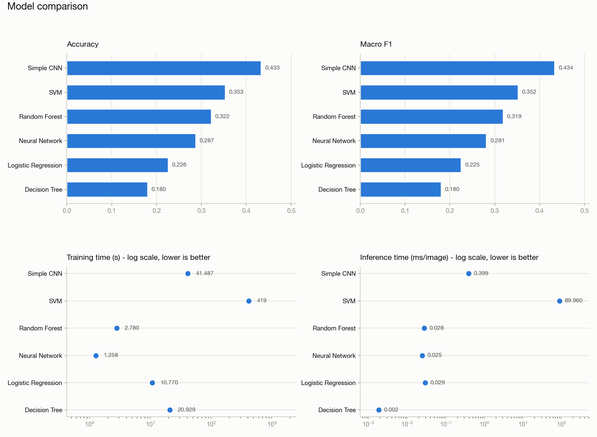

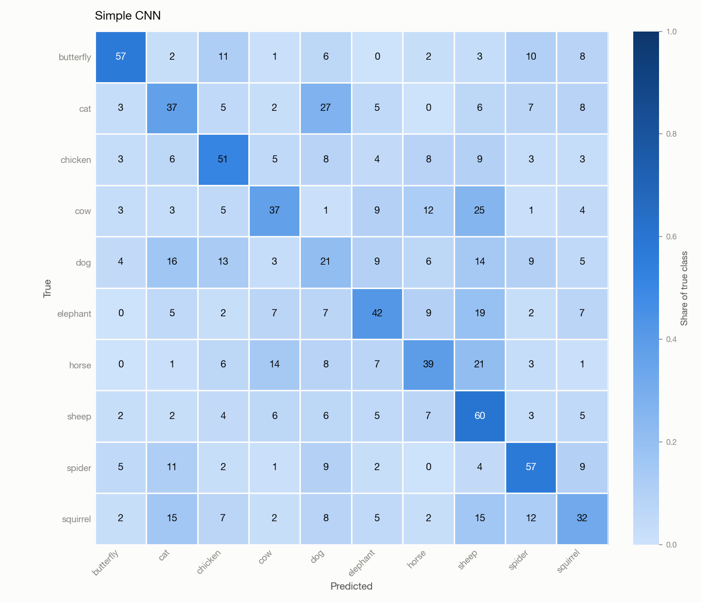

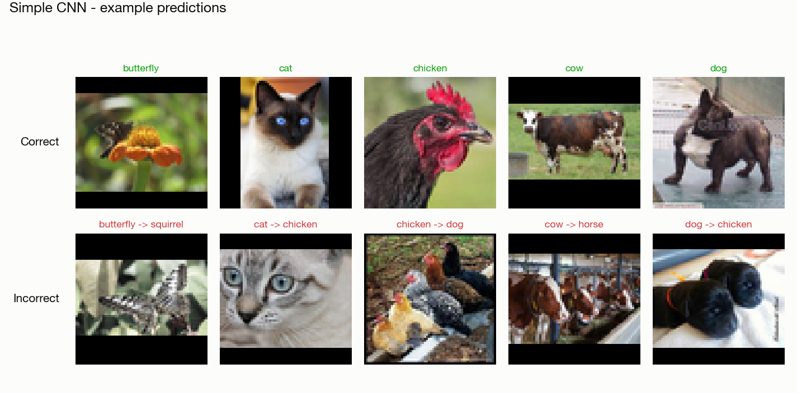

**Most frequent confusions.**

| True class | Predicted as | Images |
|---|---|---|
| cat | dog | 27 |
| cow | sheep | 25 |
| horse | sheep | 21 |
| elephant | sheep | 19 |
| dog | cat | 16 |

## 4.2 Animals-10 - rgb, 100 per class

```python
results = benchmark_image_classification(
    dataset="./data/animals10_n100/labels.csv",
    dataset_type="csv",
    target_labels="class_name",
    color_mode="rgb",
)
```

1,000 images, 10 classes, split 800 training / 200 testing at seed 42.


| Model | Accuracy | Macro Precision | Macro Recall | Macro F1 | Weighted F1 | Training Time (s) | Inference Time (ms/img) |
|---|---|---|---|---|---|---|---|
| Simple CNN | 0.320 | 0.323 | 0.320 | 0.295 | 0.295 | 7.9 | 0.393 |
| Random Forest | 0.300 | 0.310 | 0.300 | 0.294 | 0.294 | 0.6 | 0.074 |
| SVM | 0.240 | 0.265 | 0.240 | 0.242 | 0.242 | 29.4 | 22.317 |
| Logistic Regression | 0.215 | 0.216 | 0.215 | 0.213 | 0.213 | 1.1 | 0.030 |
| Neural Network | 0.180 | 0.182 | 0.180 | 0.178 | 0.178 | 0.3 | 0.025 |
| Decision Tree | 0.095 | 0.091 | 0.095 | 0.093 | 0.093 | 3.2 | 0.008 |

**Best: Simple CNN**, macro F1 0.295 (2.9x the 0.100 chance level for 10 classes).

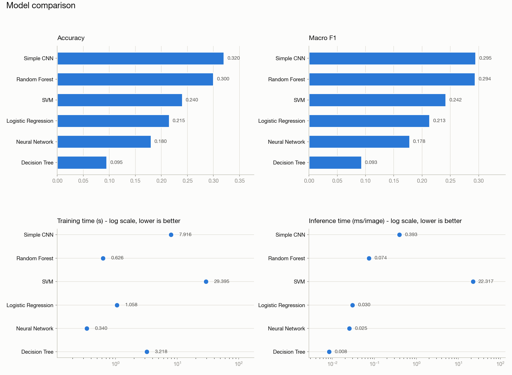

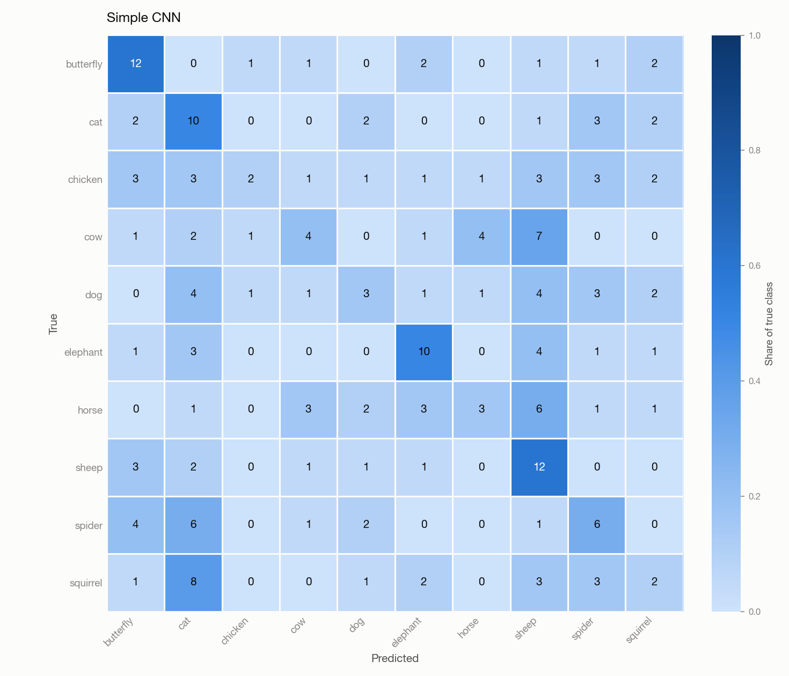

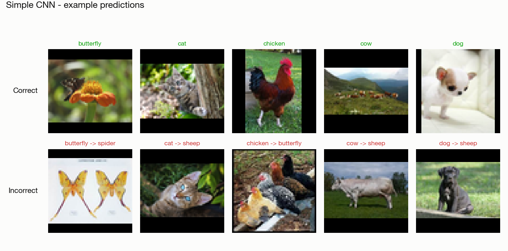

**Most frequent confusions.**

| True class | Predicted as | Images |
|---|---|---|
| squirrel | cat | 8 |
| cow | sheep | 7 |
| horse | sheep | 6 |
| spider | cat | 6 |
| cow | horse | 4 |

## 4.3 Animals-10 - grayscale, 500 per class

```python
results = benchmark_image_classification(
    dataset="./data/animals10_n500/labels.csv",
    dataset_type="csv",
    target_labels="class_name",
    color_mode="grayscale",
)
```

5,000 images, 10 classes, split 4,000 training / 1,000 testing at seed 42.


| Model | Accuracy | Macro Precision | Macro Recall | Macro F1 | Weighted F1 | Training Time (s) | Inference Time (ms/img) |
|---|---|---|---|---|---|---|---|
| Simple CNN | 0.351 | 0.351 | 0.351 | 0.349 | 0.349 | 44.9 | 0.256 |
| Random Forest | 0.299 | 0.308 | 0.299 | 0.296 | 0.296 | 1.8 | 0.029 |
| SVM | 0.283 | 0.294 | 0.283 | 0.281 | 0.281 | 13.1 | 5.904 |
| Neural Network | 0.253 | 0.255 | 0.253 | 0.251 | 0.251 | 0.5 | 0.009 |
| Decision Tree | 0.191 | 0.190 | 0.191 | 0.190 | 0.190 | 7.0 | 0.003 |
| Logistic Regression | 0.169 | 0.169 | 0.169 | 0.167 | 0.167 | 7.2 | 0.047 |

**Best: Simple CNN**, macro F1 0.349 (3.5x the 0.100 chance level for 10 classes).

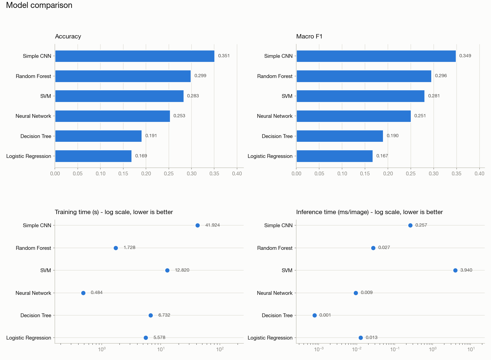

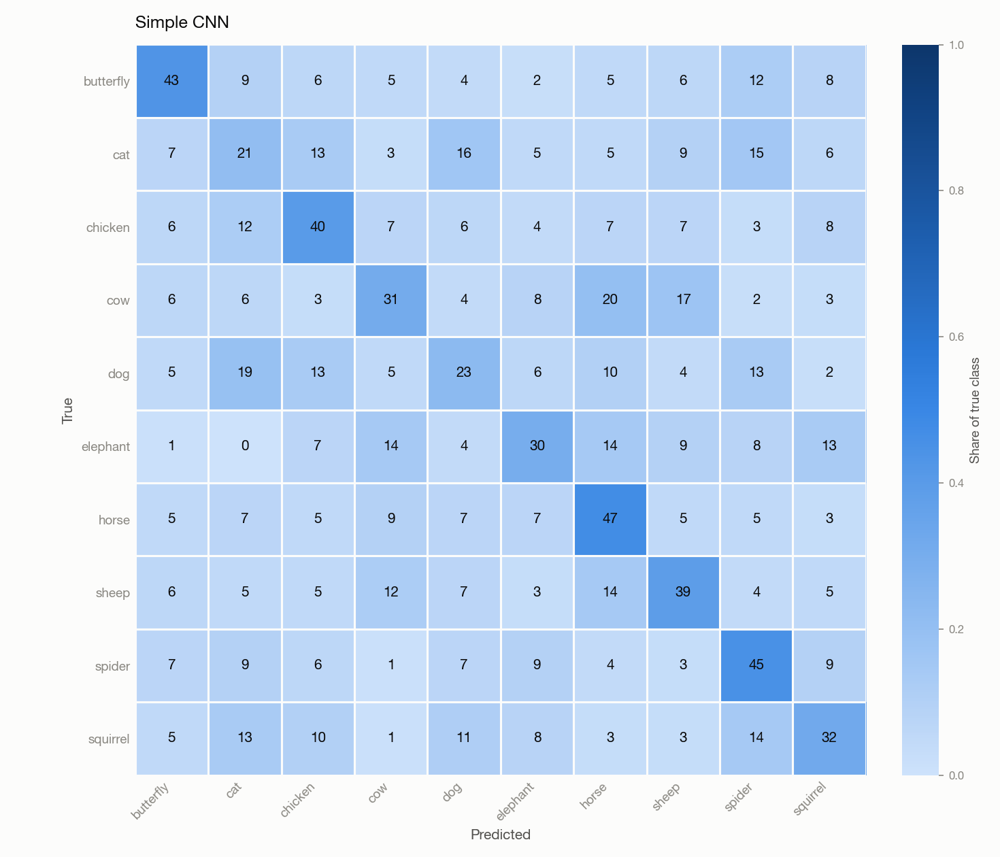

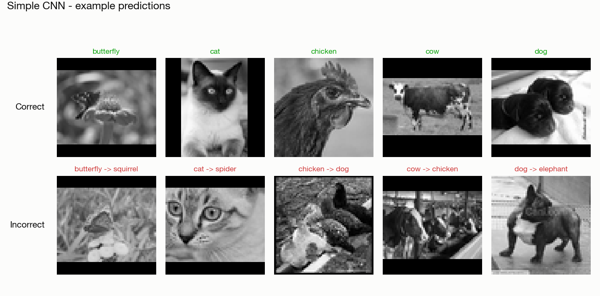

**Most frequent confusions.**

| True class | Predicted as | Images |
|---|---|---|
| cow | horse | 20 |
| dog | cat | 19 |
| cow | sheep | 17 |
| cat | dog | 16 |
| cat | spider | 15 |

## 4.4 Intel Image Classification - rgb, 500 per class

```python
results = benchmark_image_classification(
    dataset="./data/intel_n500/labels.csv",
    dataset_type="csv",
    target_labels="class_name",
    color_mode="rgb",
)
```

3,000 images, 6 classes, split 2,400 training / 600 testing at seed 42.


| Model | Accuracy | Macro Precision | Macro Recall | Macro F1 | Weighted F1 | Training Time (s) | Inference Time (ms/img) |
|---|---|---|---|---|---|---|---|
| Simple CNN | 0.705 | 0.712 | 0.705 | 0.704 | 0.704 | 36.4 | 0.799 |
| SVM | 0.625 | 0.622 | 0.625 | 0.621 | 0.621 | 110.8 | 345.075 |
| Random Forest | 0.570 | 0.566 | 0.570 | 0.564 | 0.564 | 2.6 | 0.048 |
| Neural Network | 0.498 | 0.515 | 0.498 | 0.499 | 0.499 | 0.8 | 0.026 |
| Decision Tree | 0.395 | 0.398 | 0.395 | 0.396 | 0.396 | 15.6 | 0.002 |
| Logistic Regression | 0.393 | 0.406 | 0.393 | 0.395 | 0.395 | 5.1 | 0.040 |

**Best: Simple CNN**, macro F1 0.704 (4.2x the 0.167 chance level for 6 classes).

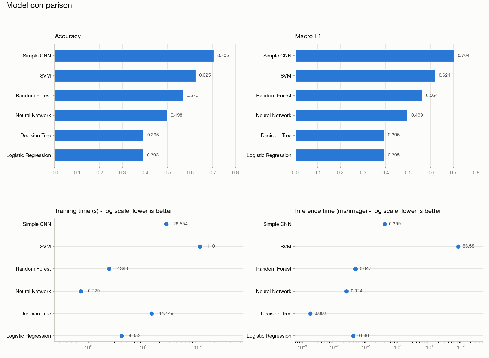

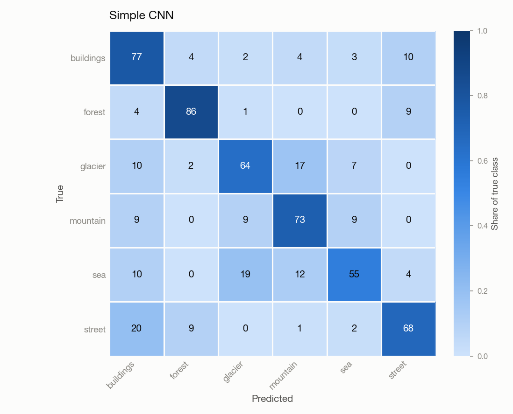

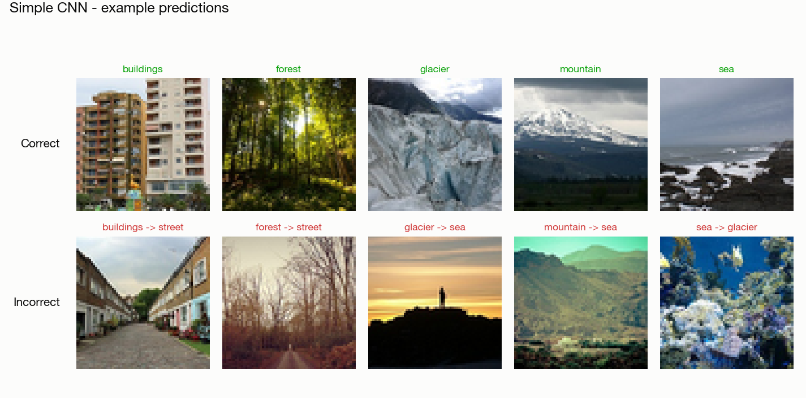

**Most frequent confusions.**

| True class | Predicted as | Images |
|---|---|---|
| street | buildings | 20 |
| sea | glacier | 19 |
| glacier | mountain | 17 |
| sea | mountain | 12 |
| buildings | street | 10 |

## 4.5 Intel Image Classification - grayscale, 500 per class

```python
results = benchmark_image_classification(
    dataset="./data/intel_n500/labels.csv",
    dataset_type="csv",
    target_labels="class_name",
    color_mode="grayscale",
)
```

3,000 images, 6 classes, split 2,400 training / 600 testing at seed 42.

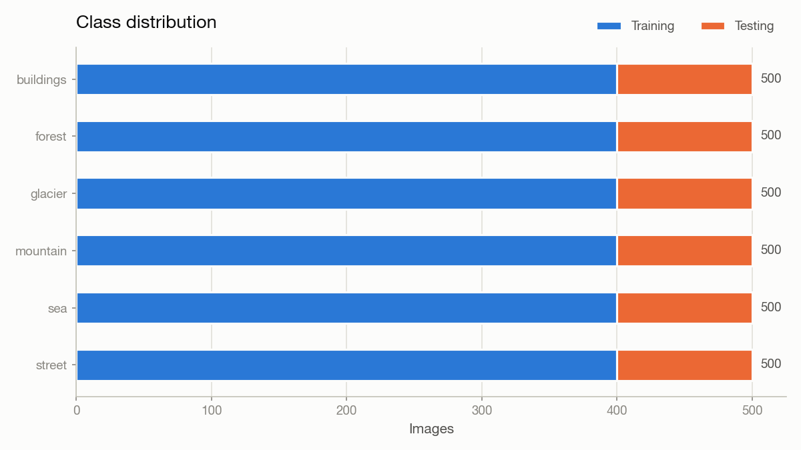

| Model | Accuracy | Macro Precision | Macro Recall | Macro F1 | Weighted F1 | Training Time (s) | Inference Time (ms/img) |
|---|---|---|---|---|---|---|---|
| Simple CNN | 0.657 | 0.657 | 0.657 | 0.656 | 0.656 | 32.1 | 0.260 |
| SVM | 0.528 | 0.523 | 0.528 | 0.516 | 0.516 | 3.7 | 3.473 |
| Random Forest | 0.505 | 0.500 | 0.505 | 0.497 | 0.497 | 1.7 | 0.048 |
| Neural Network | 0.442 | 0.434 | 0.442 | 0.433 | 0.433 | 0.3 | 0.010 |
| Decision Tree | 0.307 | 0.310 | 0.307 | 0.307 | 0.307 | 5.3 | 0.001 |
| Logistic Regression | 0.293 | 0.305 | 0.293 | 0.292 | 0.292 | 7.3 | 0.022 |

**Best: Simple CNN**, macro F1 0.656 (3.9x the 0.167 chance level for 6 classes).

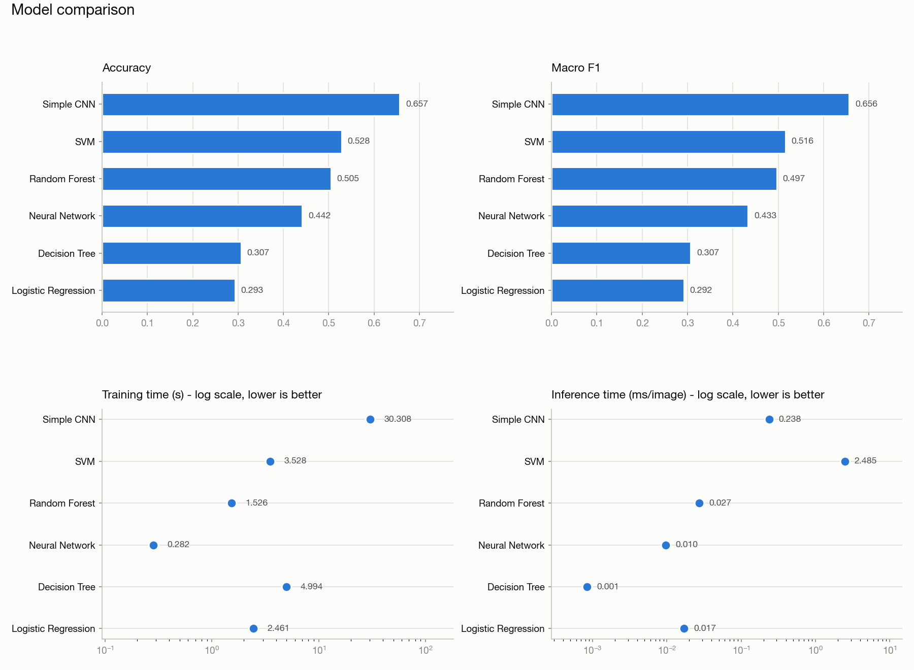

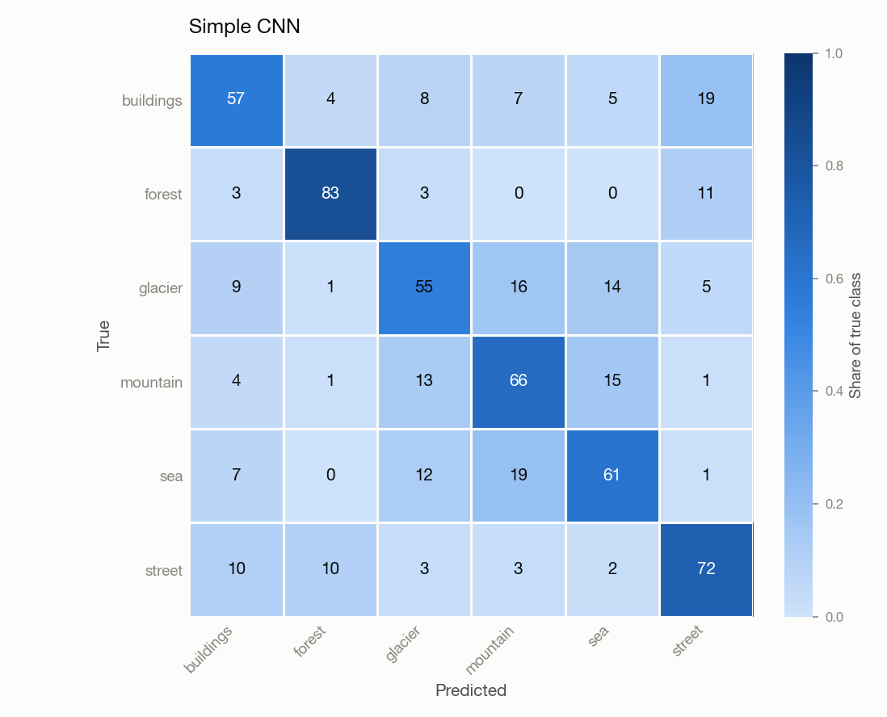

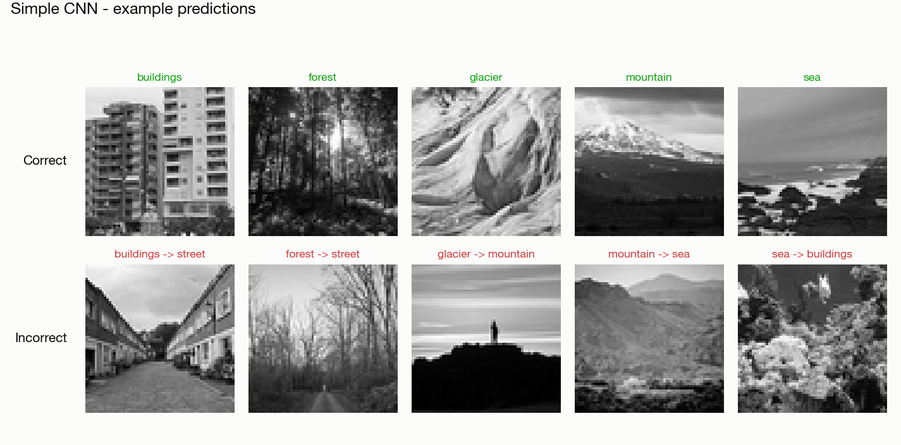

**Most frequent confusions.**

| True class | Predicted as | Images |
|---|---|---|
| buildings | street | 19 |
| sea | mountain | 19 |
| glacier | mountain | 16 |
| mountain | sea | 15 |
| glacier | sea | 14 |

## 5. Experiment: training set size

Same dataset, same color mode, nested subsets - the smaller set is a strict prefix of the larger, so this is a learning curve rather than two unrelated samples.

**Animals-10, rgb**

| Model | 100/class | 500/class | change |
|---|---|---|---|
| Simple CNN | 0.295 | 0.434 | +47% |
| SVM | 0.242 | 0.352 | +45% |
| Random Forest | 0.294 | 0.319 | +9% |
| Neural Network | 0.178 | 0.281 | +58% |
| Logistic Regression | 0.213 | 0.225 | +6% |
| Decision Tree | 0.093 | 0.180 | +94% |

Simple CNN leads at both sizes, but its margin over the runner-up widens from 0.001 to 0.082 macro F1. Models whose scores have flattened are near what raw pixels can give them; models still climbing would gain more from data than from a change of architecture.

## 6. Experiment: color

Identical images in both columns; only `color_mode` differs. Grayscale gives 4,096 features per image against RGB's 12,288.

| Model | Animals-10 | Intel Image Classification |
|---|---|---|
| Simple CNN | +24% | +7% |
| Random Forest | +8% | +14% |
| SVM | +25% | +20% |
| Neural Network | +12% | +15% |
| Decision Tree | -5% | +29% |
| Logistic Regression | +34% | +35% |

**Decision Tree disagrees across datasets** (Animals-10 -5%, Intel Image Classification +29%), so the effect belongs to the data rather than to the model. Where a class is separable by color directly, one threshold on one channel is informative; where it is not, the extra channels are mostly noise to a model with no ensemble to average them away.

**Cost.** RGB triples the feature count, and the SVM pays more than three times for it:

| Dataset | SVM training, grayscale | SVM training, RGB | factor |
|---|---|---|---|
| Animals-10 | 13.1 s | 500.4 s | 38x |
| Intel Image Classification | 3.7 s | 110.8 s | 30x |

## 7. Experiment: dataset and padding

The two datasets differ in how much of the 64x64 canvas survives standardization: Animals-10 loses 27% to padding, Intel essentially none. They also differ in class count, which has to be accounted for before the padding question can be asked at all.

| Model | Animals-10 (10c) | Intel Image Classification (6c) | Animals-10 x chance | Intel Image Classification x chance |
|---|---|---|---|---|
| Simple CNN | 0.434 | 0.704 | 4.34 | 4.22 |
| SVM | 0.352 | 0.621 | 3.52 | 3.73 |
| Random Forest | 0.319 | 0.564 | 3.19 | 3.38 |
| Neural Network | 0.281 | 0.499 | 2.81 | 2.99 |
| Logistic Regression | 0.225 | 0.395 | 2.25 | 2.37 |
| Decision Tree | 0.180 | 0.396 | 1.80 | 2.38 |

Raw scores are much higher on the dataset with fewer classes, which is what a lower chance level buys before any model does anything. Expressed as a multiple of chance the two are close (Intel Image Classification 3.18x, Animals-10 2.99x), and on that basis the padded dataset is not obviously the harder one.

**This is evidence about padding, not a measurement of it.** Class count, task difficulty and dataset size all differ between these runs, so the honest conclusion is that padding is not the dominant limitation here, not that it is free. Isolating it would need the same dataset run with and without padding, or a subset of Animals-10 cut to the same class count.

## 8. Computational cost

From animals10_n500_rgb:

| Model | Training (s) | Inference (ms/image) | Macro F1 |
|---|---|---|---|
| Simple CNN | 44.1 | 0.408 | 0.434 |
| SVM | 500.4 | 111.146 | 0.352 |
| Random Forest | 3.3 | 0.028 | 0.319 |
| Neural Network | 1.4 | 0.025 | 0.281 |
| Logistic Regression | 9.1 | 0.044 | 0.225 |
| Decision Tree | 20.8 | 0.002 | 0.180 |

Inference cost spans a factor of 59,373 between Decision Tree and SVM. Classifying a thousand images would take SVM about 111.1 seconds against Decision Tree's 0.002 seconds.

Accuracy alone would not surface this. A model chosen on macro F1 for a CPU-bound application could be unusable in practice, which is why the ranking breaks ties on the lower inference time.

## 9. Reflection

The result that changed how I think about this assignment came from running the
benchmark twice. At a hundred images per class the CNN and the Random Forest were
indistinguishable, 0.295 against 0.294 macro F1, and if I had stopped there I would have
written that a convolutional network buys you nothing over an ensemble of trees on this
problem. At five hundred per class the CNN reached 0.434 and the Random Forest only
0.319. The sentence I would have written was not a small error, it was the opposite of
what the data actually shows, and nothing about the first run looked incomplete. It had
six models, real numbers, and a clear winner. What it lacked was a second point to
compare against.

That is also why the subset sampling matters more than it first appeared. Because the
shuffle is seeded on the class name rather than the sample count, the hundred-per-class
set is a byte-identical subset of the five-hundred-per-class set, so reading across the
two is a learning curve rather than a comparison of two unrelated draws. Getting that
property took one decision early on and I did not appreciate at the time that it was the
difference between two anecdotes and one measurement.

The models separated along a line I did not expect. Logistic Regression and the Random
Forest gained six and nine percent going from eight hundred to four thousand training
images; the CNN and the SVM gained forty-seven and forty-five. Two of these models were
close to what raw pixels can give them and two were still climbing. That is a more useful
way to describe a model than its score on any single run, and it is invisible unless you
vary the one thing most benchmarks hold fixed.

Adding the second dataset taught me something about my own reasoning rather than about
the models. Intel Image Classification is square, so nothing is lost to the padding that
costs Animals-10 twenty-seven percent of its canvas, and the Intel scores came back far
higher across the board. I read that as the padding being expensive, which is what I had
gone looking for. It is not what the numbers say. Intel has six classes where Animals-10
has ten, so chance is 0.167 rather than 0.100, and once both are expressed as a multiple
of chance the two datasets are close and the CNN is very slightly better on the padded
one. My comparison had two variables moving and I had assigned the whole difference to
the one I was interested in.

The same thing happened with color. On Animals-10 the Decision Tree scored slightly
worse in RGB than in grayscale, and I had a tidy explanation ready about a single tree
overfitting the extra channels with no ensemble to average the mistake away. On Intel the
same model gained twenty-nine percent from color. The explanation was not wrong so much
as not general: Intel's classes separate on color directly, blue sea and white glacier
and green forest, where one threshold on one channel carries real information, while
brown animals photographed on green grass give a lone tree several thousand mostly noisy
columns. Two datasets turned a plausible story into a specific claim, and I would not
have caught it with one.

Macro F1 earned its place as the ranking metric during development rather than in the
final results. On an imbalanced test set I watched the fully connected network post
eighty-six percent accuracy while never once predicting the smallest class. Accuracy
barely registered the failure because that class was four of thirty-six images. Macro F1
fell to 0.62 because it weights every class the same, and zero_division=0 is what forces
the ignored class to score zero instead of quietly dropping out of the average. The
metric and the setting are not independent choices; the second is what makes the first
mean anything.

The Decision Tree scoring 0.093 at a hundred per class, below the 0.100 you get by
guessing among ten classes, was the clearest lesson in what these models actually do. A
single tree splits on individual pixel values, and one pixel out of 12,288 carries almost
no information about which animal is in the frame. Two hundred of those same trees voting
reached 0.319. Nothing changed except that the errors of many weak learners canceled,
and that is the entire idea of an ensemble, made concrete in a way a textbook description
never managed for me.

Looking at the misclassified images was worth more than any metric. Three of the five
errors I inspected were cat, cow and dog all predicted as sheep, and all three were
animals photographed standing on grass. The model appears to have learned something about
green outdoor backgrounds rather than about the animals, which no confusion matrix would
have told me on its own. Seeing the standardized sixty-four by sixty-four input rather
than the original photograph also made the cost of preserving aspect ratio obvious: on
the widest images close to half of what the network receives is black padding I put
there. I still think padding was the right choice over stretching, but it is a real price
and I would not have known its size without looking.

The habit I want to keep is treating a passing test as a claim that needs checking. I
found a preprocessing bug by breaking the code deliberately and watching which tests
failed, and the one that survived was the line I would have called the most important in
the file. I found the prediction examples were all drawn from a single class by opening
the image rather than by running the suite, which passed. A green suite says the
assertions I thought to write are satisfied. It says nothing about the ones I did not
think to write, and those turned out to be where the real mistakes were.

## 10. Reproducing these results

```bash
pip install Samuel_Collins_CV_Benchmarking

# rebuild the datasets (needs Kaggle API credentials)
python scripts/download_animals10.py --per-class 500
python scripts/download_animals10.py --per-class 100
python scripts/download_intel.py --per-class 500

# run every combination
python scripts/run_benchmarks.py
python scripts/run_benchmarks.py --color-mode grayscale

# rebuild this report from the results on disk
python scripts/generate_report.py
```

Package version 0.1.0, random seed 42, image size 64x64. Every model fixes its own random state; each run's full configuration is in its `run_configuration.json`.

The images are not committed. Both datasets are third-party collections, so the download scripts rebuild the subsets instead, and the seeded sampling makes that rebuild exact.
